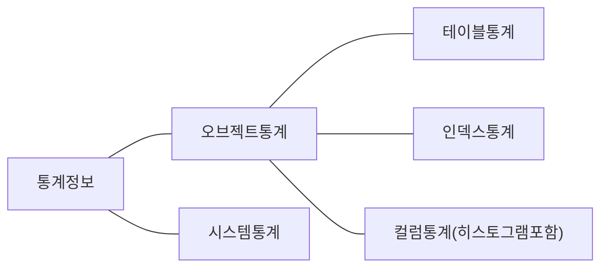
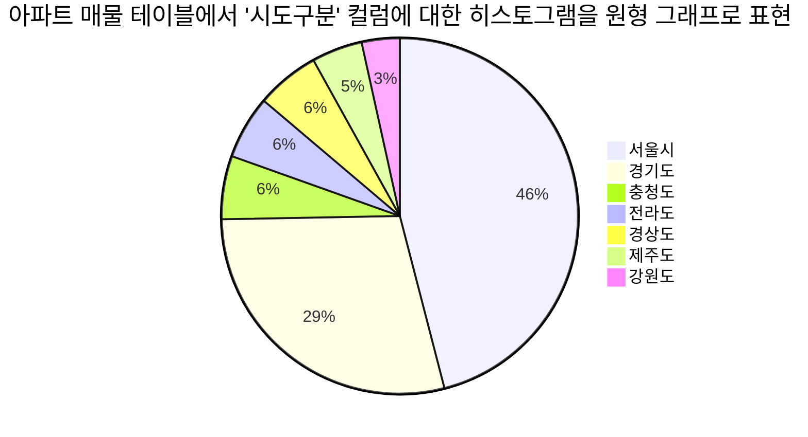

# {{ $frontmatter.title }}

[[toc]]

## 1장. SQL 처리 과정과 I/O
### 1.1 SQL 파싱과 최적화
#### 1.1.1 구조적, 집합적, 선언적 질의 언어
#### 1.1.2 SQL 최적화
#### 1.1.3 SQL 옵티마이저
#### 1.1.4 실행계획과 비용
#### 1.1.5 옵티마이저 힌트
### 1.2 SQL 공유 및 재사용
#### 1.2.1 소프트 파싱 vs. 하드 파싱
#### 1.2.2 바인드 변수의 중요성
### 데이터 저장 구조 및 I/O 메커니즘
#### 1.3.1 SQL이 느린 이유
#### 1.3.2 데이터베이스 저장 구조
#### 1.3.3 블록 단위 I/O
#### 1.3.4 시퀀셜 액세스 vs. 랜덤 액세스
#### 1.3.5 논리적 I/O vs. 물리적 I/O
#### 1.3.6 Single Block vs. Multiblock I/O
#### 1.3.7 Table Full Scan vs. Index Range Scan
#### 1.3.8 캐시 탐색 매커니즘

## 2장. 인덱스 기본
### 2.1 인덱스 구조 및 탐색
#### 2.1.1. 미리보는 인덱스 튜닝
#### 2.1.2 인덱스 구조
#### 2.1.3 인덱스 수직적 탐색
#### 2.1.4 인덱스 수평적 탐색
#### 2.1.5 결합 인덱스 구조와 탐색
### 2.2 인덱스 기본 사용법
#### 2.2.1 인덱스를 사용한다는것
#### 2.2.2. 인덱스를 Range Scan 할 수 없는 이유
#### 2.2.3 더 중요한 인덱스 사용 조건
#### 2.2.4 인덱스를 이용한 소트 연산 생략
#### 2.2.5 ORDER BY 절에서 컬럼 가공
#### 2.2.6 SELECT-LIST 에서 컬럼 가공
#### 2.2.7 자동 형변환
### 2.3 인덱스 확장기능 사용법
#### 2.3.1 Index Range Scan
#### 2.3.2 Index Full Scan
#### 2.3.3 Index Unique Scan
#### 2.3.4 Index Skip Scan
#### 2.3.5 Index Fast Full Scan
#### 2.3.6 Index Range Scan Descending
## 3장. 인덱스 튜닝
### 3.1 테이블 액세스 최소화
#### 3.1.1 테이블 랜덤 액세스
#### 3.1.2 인덱스 클러스터링 팩서
#### 3.1.3 인덱스 손익분기점
#### 3.1.4 인덱스 컬럼 추가
#### 3.1.5 인덱스만 읽고 처리
#### 3.1.6 인덱스 구조 테이블
#### 3.1.7 클러스터 테이블
### 3.2 부분범위 처리 활용
#### 3.2.1 부분범위 처리
#### 3.2.2 부분범위 처리 구현
#### OLTP 환경에서 부분범위 처리에 의한 성능개선 원리
### 3.3 인덱스 스캔 효율화
#### 3.3.1 인덱스 탐색
#### 3.3.2 인덱스 스캔 효율성
#### 3.3.3 액세스 조건과 필터 조건
#### 3.3.4 비교 연산자 종류와 컬럼 순서에 다른 군집성
#### 3.3.5 인덱스 선행 컬럼이 등치(=) 조건이 아닐 때 생기는 비효율
#### 3.3.6 BETWEEN 을 IN-List로 전환
#### 3.3.7 Index Skip Scan 활용
#### 3.3.8 IN 조건은 '='인가
#### 3.3.9 BETWEEN과 LIKE 스캔 범위 비교
#### 3.3.10 범위 검색 조건을 남용할 때 생기는 비효율
#### 3.3.11 다양한 옵션 처리 방식의 장단점 비교
#### 3.3.12 함수호출부하 해소를 위한 인덱스 구성
### 3.4 인덱스 설계
#### 3.4.1 인덱스 설계가 어려운 이유
#### 3.4.2 가장 중요한 두가지 선택 기준
#### 3.4.3 스캔 효율성 이외의 판단 기준
#### 3.4.4 공식을 초월한 전략적 설계
#### 3.4.5 소트 연산을 생략하기 위한 컬럼 추가
#### 3.4.6 결합 인덱스 선택도
#### 3.4.7 중복 인덱스 제거
#### 3.4.8 인덱스 설계도 작성
## 4장. 조인 튜닝
### 4.1 NL튜닝
#### 4.1.1 기본 매커니즘
#### 4.1.2 NL 조인 실행계획 제어
#### 4.1.3 NL 조인 수행 과정 분석
#### 4.1.4 NL 조인 튜닝 포인트
#### 4.1.5 NL 조인 특징 요약
#### 4.1.6 NL 조인 튜닝 실습
#### 4.1.7 NL 조인 확장 매커니즘
### 4.2 소트 머지 조인
#### 4.2.1 SGA vs. PGA
#### 4.2.2 기본 매커니즘
#### 4.2.3 소트머지 조인이 빠른 이유
#### 4.2.4 소트머지 조인의 주용도
#### 4.2.5 소트머지 조인 제어하기
#### 4.2.6 소트머지 조인 특징 요약
### 4.3 해시 조인
#### 4.3.1 기본 매커니즘
#### 4.3.2 해시조인이 빠른 이유
#### 4.3.3 대용량 Build Input 처리
#### 4.3.4 해시 조인 실행계획 제어
#### 4.3.5 조인 메소드 선택 기준
### 4.4 서브쿼리 조인
#### 4.4.1 서브쿼리 변환이 필요한 이유
#### 4.4.2 서브쿼리와 조인
#### 4.4.3 뷰(View) 와 조인
#### 4.4.4 스칼라 서브쿼리 조인
## 5장. 소트 튜닝
### 5.1 소트 연산에 대한 이해
#### 5.1.1 소트 수행 과정
#### 5.1.2 소트 오퍼레이션
### 5.2 소트가 발생하지 않도록 SQL 작성
#### 5.2.1 Union vs. Union All
#### 5.2.2 Exists 활용
### 5.3 인덱스를 이용한 소트 연산 생략
#### 5.3.1 Sort Order By 생략
#### 5.3.2 Top N 쿼리
#### 5.3.3 최소값/최대값 구하기
#### 5.3.4 이력 조회
#### 5.3.5 Sort Group By 생략
### 5.4 Sort Area를 적게 사용하도록 SQL 작성
#### 5.4.1 소트 데이터 줄이기
#### 5.4.2 Top N 쿼리의 소트 부하 경감 원리
#### 5.4.3 Top N 쿼리가 아닐 때 발생하는 소트 부하
#### 5.4.4 분석함수에서의 Top N 소트
## 6장. DML 튜닝
### 6.1 기본 DML 튜닝
#### 6.1.1 DML 성능에 영향을 미치는 요서
#### 6.1.2 데이터베이스 Call 과 성능
#### 6.1.3 Array Processing 활용
#### 6.1.4 인덱스 및 제약 해제를 통한 대량 DML 튜닝
#### 6.1.5 수정가능 조인 뷰
#### 6.1.6 MERGE문 활용
### 6.2 Direct Path I/O 활용
#### 6.2.1 Direct Path I/O
#### 6.2.2 Direct Path Insert
#### 6.2.3 병렬 DML
### 6.3 파티션을 이용한 DML 튜닝
#### 6.3.1 테이블 파티션
#### 6.3.2 인덱스 파티현
#### 6.3.3 파티션을 활용한 대량 UPDATE 튜닝
#### 6.3.4 파티션을 활용한 대량 DELETE 튜닝
#### 6.4.5 파티션을 활용한 대량 INSERT 튜닝
### 6.4 Lock 과 트랜잭션 동시성 제어
#### 6.4.1 오라클 Lock
#### 6.4.2 트랜잭션 동시성 제어
#### 6.4.3 채번 방식에 따른 INSERT 성능 비교

## 7장. 옵티마이저
### 7.1 통계정보와 비용 계산 원리
#### 7.1.1 선택도와 카디널리티
- 선택도(Selectivity) : 전체 레코드 중에서 조건절에 의해 선택되는 레코드 비율
- 선택도 = 1/NDV(컬럼 값 종류 개수 'Number of Distinct Values')
- 카디널리티(Cardinality) : 전체 레코드 중에서 조건절에 의해 선택되는 레코드 개수
- 카디널리티 = 총 로우 수 X 선택도 = 총 로우수 / NDV
- ex : 상품분류컬럼에 '가전', '의류', '식음료', '생활용품' 네개의 값이 있을때, 선택도는 25%(1/4). 전체 레코드가 10만건이면 카디널리티는 2만5천이다.
- 옵티마이저는 이렇게 카디널리티를 구하고, 그만큼의 데이터를 액세스 하는 데 드는 비용을 계산해서 테이블 액세스 방식, 조인 순서, 조인 방식 등을 결정. 비용을 계산하는 출발점은 선택도다. 선택도를 잘못 계산하면 카티널리티와 비용도 잘못 계산하고 결과적으로 비효율 적인 액세스 방식과 조인 방식 선택
- 선택도를 계산할때 NDV를 사용하므로 통계정보 수집 과정에서 이 값을 정확히 구하는 것이 매우 중요하다. 통계정보 수집주기, 샘플링 비율 등을 잘 결정해야 하는 이유다.
#### 7.1.2 통계정보

##### (1) 테이블 통계
```sql
-- 테이블 통계를 수집하는 명령어
begin
	dbms_stats.gather_table_stats('scott','emp');
end;
/
```
``` sql
-- 수집된 테이블 통계정보는 아래와 같이 조회할 수 있고, all_tab_statistics 뷰 에서도 같은 정보를 확인할 수 있다
select num_rows, block, avg_row_len, sample_size, last_analyzed
from all_tables
where owner = 'SCOTT'
and table_name = 'EMP'
```
|통계항목| 설명 |
|--|--|
| NUM_ROWS | 테이블에 저장된 총 레코드 개수 |
| BLOCKS | 테이블 블록 수 = '사용된' 익스텐트(데이터가 한건이라도 입력된 적이 잇는 모든 익스텐트) 에 속한 총 블록 수
| AVG_ROW_LEN | 레코드당 평균 길이|
| SAMPLE_SIZE | 샘플링한 레코드 수|
| LAST_ANALYZED| 통계정보 수집 일시|
##### (2)인덱스 통계
```sql
-- 인덱스 통계만 수집
begin
	dbms_stats.gather_index_stats (ownname => 'scott', indname => 'emp_x01');
end;
\
-- 테이블 통계를 수집하면서 인덱스 통계도 수집
begin
	dbms_stats.gather_table_stats ('scott','emp', cascade=> true);
end;
\
```
```sql
-- 수집된 인덱스 통계정보 조회, all_ind_statistics 뷰에서도 같은 정보 확인 가능
select blevel, leaf_blocks, num_rows, distinct_keys
	 , avg_leaf_blocks_per_key, avg_data_blocks_per_key, clustering_factor
	 , sample_size, last_analyzed
  from all_indexes
 where owner = 'SCOTT'
   and table_name = 'EMP'
   and index_name = 'EMP_X01'
```
|통계항목|설명|용도
|--|--|--|
| BLEVEL | 브랜치 레벨의 약자. 인덱스 루트에서 리프 블록에 도달하기 직전까지 읽게 되는 블록의 수| 인덱스 수직적 탐색 비용 계산(2장 1절(2.1) 과 3장3절(3.3) 참조)|
|LEAF_BLOCK|인덱스 리프 블록 총 개수| 인덱스 수평적 탐색 비용 계산(2.1)(3.3)참조|
|NUM_ROWS|인덱스에 저장된 레코드 개수| 인덱스 수평적 탐색 비용 계산(2.1)(3.3)참조|
|DISTINCT_KEYS|인덱스 키값의 조합으로 만들어지는 값의 종류 개수. 예를 들어 C1+C2로 구성한 인덱스에서 C1컬럼에 3개, C2컬럼에 4개 값이 있으면 최대 12개의 값의 종류가 만들어 지는데, 인덱스에 저장된 데이터 기준으로 실제 입력된 값의 종류 개수를 구해놓은 수치. 인덱스 키값을 모두 '=' 조건으로 조회할 때의 선택도(Selectivity)를 계산하는데 사용| 인덱스 수평적 탐색 비용 계산(2.1)(3.3)참조|
|AVG_LEAF_BLOCKS_PER_KEY|인덱스 키값을 모두 '=' 조건으로 조회할 때 읽게 될 리프 블록 개수| 인덱스 수평적 탐색 비용 계산(2.1)(3.3)참조|
|AVG_DATA_BLOCKS_PER_KEY|인덱스 키값을 모두 '=' 조건으로 조회할 때 읽게 될 테이블블록 개수|테이블 액세스 비용 계산(3.1)참조|
|CLUSTERING_FACTOR| 인덱스 키값 기준으로 테이블 데이터가 모여 있는 정도. 인덱스 전체 레코드를 스캔하면서 테이블 레코드를 찾아 갈 때 읽게 될 테이블 블록 개수를 미리 계싼해 놓은 수치(3.1.2)참조|테이블 액세스 비용 계산(3.1)참조|
##### (3) 컬럼 통계
```sql
select num_distinct, density, avg_col_len, low_value, high_value, num_nulls
     , last_analyzed, sample_size
  from all_tab_columns
 where owner = 'SCOTT'
   and table_name = 'EMP'
   and column_name = 'DEPTNO';
```
| 통계항목 | 설명 |
| -- | -- |
| NUM_DISTINCT | 컬럼 값의 종류 개수(NVD,Number of Distinct Values) 예를 들어 성별 컬럼이면 2 |
| DEINSITY | '=' 조건으로 검색할때의 선택도를 미리 구해놓은 값 |
| AVG_COL_LEN | 컬럼 평균 길이(Bytes) |
| LOW_VALUE | 최소값 |
| HIGH_VALUE | 최대값 |
| NUM_NULLS | 값이 NULL 인 레코드 수 |
##### 컬럼 히스토그램
- '=' 조건에 대한 선택도 =  `1/NUM_DISTINCT` 또는 미리 구해놓은 DENSITY 값을 이용하면 된다.
- 데이터 분포가 균일하지 못한 경우 공식이 잘 들어맞지 않음. -> 비용 잘못 산정하여 최적이 아닌 실행계획으로 이어진다.
- 따라서 옵티마이저는 일반적인 컬럼 통계 외에 히스토그램을 추가로 활용한다.

|히스토그램 유형|설명|
|--|--|
|도수분포(FREQUENCY)|값별로 빈도수 저장|
|높이균형(HEIGHT_BALANCED)|각 버킷의 높이가 동일하도록 데이터 분포 관리|
|상위도수분포(TOP-FREQUENCY)|많은 레코드를 가진 상위 n개 값에 대한 빈도수 저장(12c이상)|
|하이브리드(HYBRID)|도수분포와 높이균형 히스토그램의 특성 결합|
```sql
-- 히스토그램 수집. 테이블 통계 수집할때 method_opt 파라미터를 지정하면 된다
begin
	dbms_stats.gather_table_stats('scott','emp'
	, cascade=>false, method_opt=>'for columns ename size 10, deptno size 4');
end;
\
```
```sql
begin
	dbms_stats.gather_table_stats('scott','emp'
	, cascade=>false, method_opt=>'for all columns size 75');
end;
\
begin
	dbms_stats.gather_table_stats('scott','emp'
	, cascade=>false, method_opt=>'for all columns size auto');
end;
\
```
```sql
-- 수집된 컬럼 히스토그램 조회, all_tab_histograms 뷰에서도 같은 정보를 확인할 수 있다
select endpoint_value, endpoint_number
  from all_histograms
 where owner ='SCOTT'
   and table_name = 'EMP'
   and column_name = 'DEPTNO'
 order by endpoint_value;
 ```
 ##### (4) 시스템 통계
 - 시스템통계 : 어플리케이션 및 하드웨어 성능 특성을 측정한 것. CPU 속도, 평균적인 Single Block I/O 속도, 평균적인 Multiblock I/O 속도, 평균적인 Multiblock I/O 개수, I/O 서브시스템의 최대 처리량(Throughput), 병렬 Slave의 평균적인 처리량(Throuthput)
 - 시스템 사양, 애플리케이션 특성(OLAP, DW) 및 동시 트랜잭션 발생량에 따라서도 성능 특성이 달라진다. 이에 오라클에서 특성 반영을 위해 9i부터 시스템 통계 수집 기능 도입
 ```sql
 -- 시스템 통계 조회
 select sname, pname, pval1, pval2 from sys.aux_stats$;
 ``` 

#### 7.1.3 비용 계산 원리
### 7.2 옵티마이저에 대한 이해
#### 7.2.1 옵티마이저 종류
#### 7.2.2 옵티마이저 모드
#### 7.2.3 옵티마이저에 영향을 미치는 요소
#### 7.2.4 옵티마이저의 한계
#### 7.2.5 개발자의 역할
#### 7.2.6 튜닝 전문가 되는 공부방법

## 부록. SQL 분석 도구
### 1. 실행계획 확인
### 2. AutoTrace
### 3. SQL 트레이스
### 4. DBMS_XPLAN 패키지
### 5. 실시간 SQL 모니터링
### 6. V$SQL


