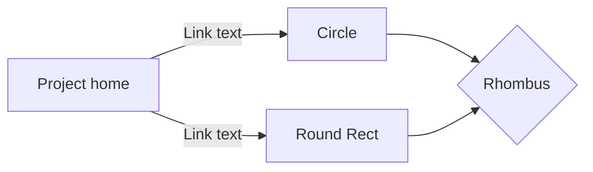

#  자바 프로젝트를 메이븐 프로젝트로 변환하기

자바 프로젝트 선택후 마우스 우클릭 -> Configure 선택 -> Convert to Maven Project 선택

## 프로젝트 구조
- src/main/java : 프로젝트에 필요한 모든 자바 클래스를 개발해 저장하는 폴더
- src/test/java : 프로젝트의 테스트 코드를 개발해 저장하는 폴더
- src/main/resources : 응용프로그램에서 사용하는 텍스트 파일 등 추가 자원을 포함하는 폴더다
- src/test/resources : 테스트에서 사용할 추가 자원을 포함하는 폴더.

## 일반적인 메이븐 프로젝트 구조를 요약한 모습

<!--stackedit_data:
eyJoaXN0b3J5IjpbLTIwOTkxODUzMTJdfQ==
-->