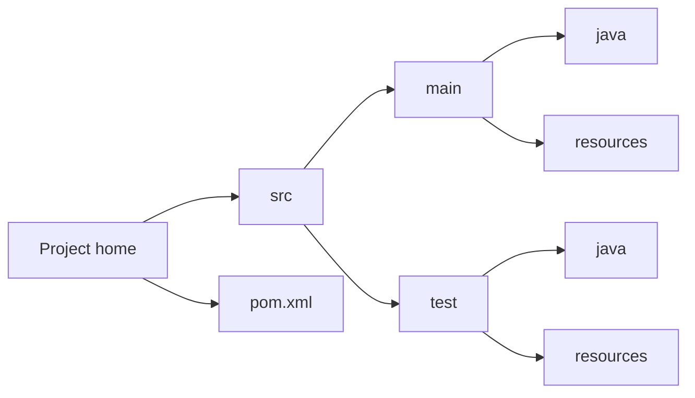

#  자바 프로젝트를 메이븐 프로젝트로 변환하기

자바 프로젝트 선택후 마우스 우클릭 -> Configure 선택 -> Convert to Maven Project 선택

## 메이븐 프로젝트 구조
- src/main/java : 프로젝트에 필요한 모든 자바 클래스를 개발해 저장하는 폴더
- src/test/java : 프로젝트의 테스트 코드를 개발해 저장하는 폴더
- src/main/resources : 응용프로그램에서 사용하는 텍스트 파일 등 추가 자원을 포함하는 폴더다
- src/test/resources : 테스트에서 사용할 추가 자원을 포함하는 폴더.

## 일반적인 메이븐 프로젝트 구조를 요약한 모습

## 메이븐 빌드 파일 예제 pom.xml
- project : pom.xml 파일의 최상위 수준 요소다
- groupId : 프로젝트를 만드는 조직의 고유 식별자를 지정한다
- artifactId : 빌드 과정에서 생성된 부산물의 고유한 기본 이름을 지정한다
- packaging : 부산물에 사용할 패키지 형식(JAR, WAR, EAR등)을 지정한다. 이 요소를 생략하면 JAR를 사용한다.
- version : 프로젝트에서 생성하는 부산물 버전을 지정한다
- build : 플러그인, 자원 등 빌드 과정을 가이드하는 다양한 설정을 지정한다.
- dependencies : 프로젝트의 디펜던시 목록을 지정한다.

## 메이븐 명령어
- mvn clean : 빌드하기 전에 기존 빌드에서 생성된 부산물을 정리한다
- mvn compile : 프로젝트의 소스코드를 컴파일(기본적으로 생성된 target 폴더에 결과를 저장) 한다.
- mvn test : 컴파일된 소스코드를 테스트한다
- mvn package : JAR과 같은 적절한 형식으로 컴파일된 코드를 패키징한다.

## 메이븐 vs 그레이들
메이븐 단점 == `xml` 의 단점 : 작업하기 귀찮고, 가독성이 떨어짐

<!--stackedit_data:
eyJoaXN0b3J5IjpbMTg2MTk4MDI1NCwxOTI0NzQwMDgwLDM5Mz
MxMTY0OF19
-->