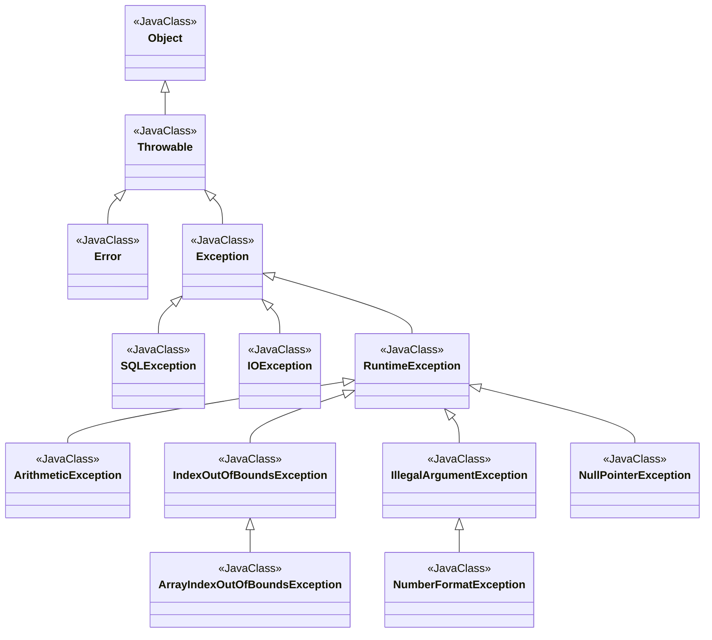

# java exception

[[toc]]

|checked Exception|Unchecked Exception|
|--|--|
|반드시 예외를 처리해야함|명시적인 처리를 강제하지 않음|
|컴파일 단계|실행단계|
|예외발생시 트랜잭션 roll-back|roll-back 하지 않음|
|IoException, SQLException | NullPointerException, llegalArgumentException|

