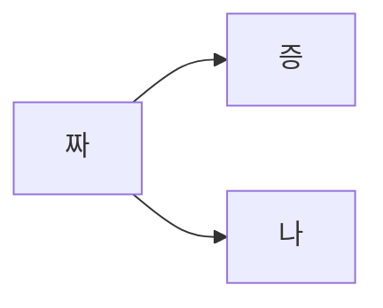

# {{ $frontmatter.title }}

내 블로그에 적용한 플러그인들 정리

```js
--2023.11.16
"dependencies": {
    "esm": "^3.0.0",
    "json-fn": "^1.1.1",
    "vuepress": "^1.9.10",
    "vuepress-plugin-chart": "^0.3.0",
    "vuepress-plugin-flowchart": "^1.5.0",
    "vuepress-plugin-mermaidjs": "^1.9.1",
    "vuepress-plugin-seo": "^0.1.4",
    "vuepress-plugin-sitemap": "^2.3.1"
  },
```
## official plugins(참고용)
- [link](https://github.com/vuepress/awesome-vuepress/blob/main/v1.md#official-plugins)

## vuepress-plugin-mermaidjs
- version : 1.9.1
- document
    - [theme-hope-mermaid](https://theme-hope.vuejs.press/guide/markdown/mermaid.html#demo)
    - [mermaid.js doc](https://mermaid.js.org/intro/)

mermaid를 쓰고 싶은 이유는 단 한가지다 Stackedit 에서 지원하기 때문... 암튼 첨에 걍 설치하고 적용했더니 동작이 되지 않는 거시다 
[vuepress/issues/111](https://github.com/vuejs/vuepress/issues/111)
보고 시키는대로 다 해봤는데 적용이 안된다.... 
포기하고 다른 공식 플러그인을 적용해서 쓸까.. 했는데 stackedit에서 사용하는 그 편리함을 포기하지 못하겠어서.. 다음날 다시 시도...
(flowchart 설치한 김에 계속 유지하겠음 언젠가는 쓰겠지)  


[공식 문서](https://www.npmjs.com/package/vuepress-plugin-mermaidjs?activeTab=readme)에 mermaid 1.xx 버전이 vuepress 1.xx 버전과 호환된다고 되어 있기에... 이번에 1.9.1을 설치 했다
(씁 근데 어제도 1.XX 설치 해봤었는데 안됐었는데... 아무튼 지금 내 vuepress 버전 1.9.10 이랑 mermaid 버전 1.9.1 이 잘 맞는걸로...)

```sh
npm i vuepress-plugin-mermaidjs@1.9.1
```

``` js
--config.js 

plugins: [
    'flowchart',
    'vuepress-plugin-mermaidjs',
    ['sitemap', { hostname: 'https://leekyounghwa.github.io'}],
  ],
```



    ```mermaid
    graph LR
    A[짜] --> B[증]
    A --> C[나]
    ```

허망하게 바로 적용되어 버림... 결론... 버전 체크하고 명시하는 습관을 가지자... ㅜㅜ.....


## vuepress-plugin-seo
- version : 0.1.4
- document : [vuepress-plugin-seo](https://github.com/lorisleiva/vuepress-plugin-seo)

```
npm i vuepress-plugin-seo@0.1.4
```  

는 역시나 그냥 설치하니까 안됬다(버전 명시 안해주면 0.2.0. 설치됨).  
이건 뭐 공식문서에서도 버전 관련된 내용은 없고  
그냥 될줄 알았지.... 설치하고 아무리 내가 커스텀 설정을 해도 meta가 생기지도 않고 그대로인 것이다.  
혹시나.. 해서 버전을 낮춰서 설치 해 줬다. 

[버전](https://www.npmjs.com/package/vuepress-plugin-seo?activeTab=versions) 보면 최근 7일간 0.1.4 가 제일 설치가 많이 되었다.

`버전 체크 + 다운로드 횟수를 잘 보자.`


이정도 양은 생성되어야 제대로 적용된거임.

```js
-- config.js
 ['seo', {
        image: ($page, $site) => $page.frontmatter.image || ($site.themeConfig.domain + $site.themeConfig.logo),
        modifiedAt: $page => $page.frontmatter.lastUpdated,
    }],
```
config.js 에 커스텀으로 두줄만 설정해 줬다.  

frontmatter 에 이미지 없으면 그냥 로고 노출해주게 설정해줬고,  

stackedit으로 막 편집하면서 글 써서 글로벌 lastUpdated 는 false 로 걍 꺼놨었었다.  
그래서 frontmatter 에 명시해준로 쓰게 바꿔줬다.

[vuepress 공식문서 글로벌 변수 참고](https://v1.vuepress.vuejs.org/guide/global-computed.html#site)

## vuepress-plugin-chart 
- version : 0.3.0
- document 
    - [chart.js](https://www.chartjs.org/docs/latest/charts/bar.html)
    - [vuepress-plugin-chart@next](https://github.com/Renovamen/vuepress-theme-gungnir/tree/main/packages/plugins/chart)

뷰프레스 블로그에 차트 적용 할 수 있음.  
저기 공식 문서에 있는 [vuepress-plugin-chart@next](https://github.com/Renovamen/vuepress-theme-gungnir/tree/main/packages/plugins/chart) 는 vuepress2에 적용하는 거라고 해서 1에 적용 가능한게 있는지 검색해보았다.  

[npmjs/vuepress-plugin-chart](https://www.npmjs.com/package/vuepress-plugin-chart/v/0.3.0?activeTab=versions)  

버전 낮은걸로 설치 해줬다 (0.3.0)


    npm i vuepress-plugin-chart


config.js 설정해주니 불친절한 에러발생  
대충 읽어보니 json-fn 이게 없다고 하는거 같음
추가로 설치해줬다  
(쩝.. 왜 의존으로 같이 설치 안되는거..?!)


    npm i json-fn


차트 잘 작성됨! 
가계부나 투자일지 쓰기 좋을거같다.. 크크

```chart
{
  "type": "doughnut",
  "data": {
    "datasets": [{
      "data": [10, 20, 30],
      "backgroundColor": [
        "rgba(255, 99, 132)",
        "rgba(255, 206, 86)",
        "rgba(54, 162, 235)"
      ]
    }],
    "labels": ["Red", "Yellow", "Blue"]
  }
}
```