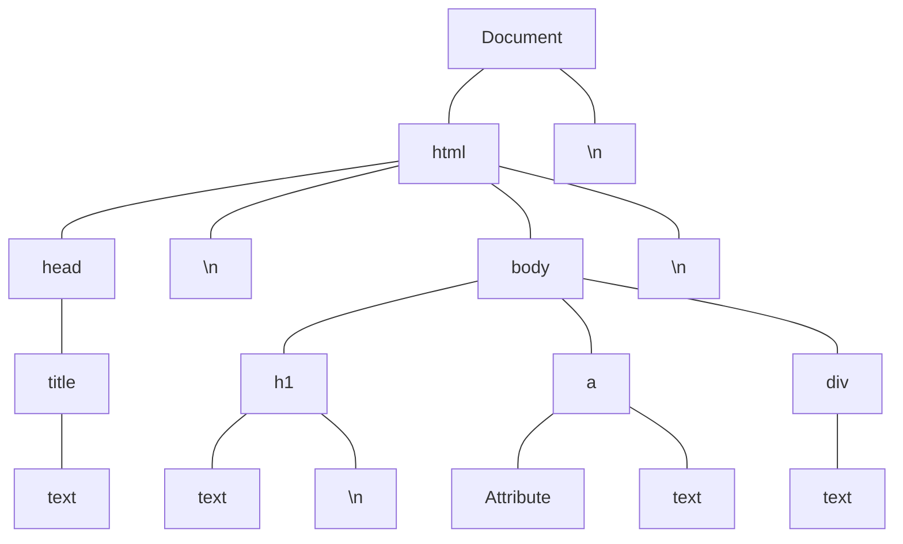

# 자바스크립트파워북

## var, let, const

- let 은 전역객체 this. 로 접근 불가능. 자신의 scope블록과 선언된 블록의 하위 블록에서만 접근 가능
- let 권장
- var 변수는 호이스팅 발생.
- 호이스팅이란 런타임 시점에 함수 맨 위로 선언이 이동하는것. 스크립트형 언어인 자바스크립트가 변수나 함수가 선언되지 않은 상태에서 사용할 수 있도록 해주는 기반이 되는 기법이다.

```js
let sum = sum + 10; // error
var sum2 = sum2 + 10;
```

## 원시형, 참조형

- 원시형 : 숫자형(Number), 불리언형(Boolean), 문자형(String), 심볼형(Symbol), Null, Undefined
- 참조형 : 객체

## 자료형변환

- NaN : Not a Number. 문자 -> 숫자형 불가능 한 경우 NaN 리턴
- Infinity(무한) ex) 1/Infinity
- parseInt(), parseFloat()
- toString(), (3.14).toString()
- toFixed() : 소수점 자리수 설정
- Math.floor() : 내림
- Math.ceil() : 올림
- Math.round() : 소수점 숫자가 가까운 쪽의 정수 반환
- Math.trunc() : 소수점 이하 모두 버리고 정수형으로
- Math.abs() : 숫자의 부호 없앰.
- Math.sign() : 숫자의 부호 알려줌.

> 자바스크립트에는 -0 이 존재함
> NaN 와 Infinity는 숫자값은 아니지만 숫자 타입으로 정의툄
> 자바스크립트에는 소수점 오류를 내재하고 있음. 정밀한 단위의 소수점 단위 합계를 누적하거나 차감하는 경우 최종 값이 실제 값과 차이나는 경우가 발생 할 수 있다.
> Number.MAX_SAFE_INTEGER를 초과해서는 안된다

## Null, Undefined, 0

- Null : 변수가 빈값
- undefined : 변수가 정의되지 않음

```js
let a = null;
let b; // 사용 지양할것!!
a == b ? "같음" : "다름"; // 같음
a === b ? "같음" : "다름"; // 다름
```

## for ~ of 문

배열, 문자열, 맴, 셋. 일반 객체에는 사용할 수 없음

```js
let friends = [
  { name: "라이언", age: 5 },
  { name: "어피치", age: 4 },
  { name: "콘", age: 2 },
  { name: "무지", age: 3 },
];
for (let friend of friends) {
  console.log("이름 : " + friend.name + " 나이: " + friend.age);
}
```

## for ~ in

객체 사용 가능. 배열,문자열, 맵, 셋 에 사용할 경우 배열의 인덱스 값만 반환되므로 주의  
객체의 속성과 속성값 나열.

```js
let ryon = { name: "라이언", age: 5, gendor: "male" };
for (let prop in ryon) {
  console.log("속성: " + prop + "값 : " + ryon[prop]);
}
```

## forEach

```js
let friends = [
  { name: "라이언", age: 5 },
  { name: "어피치", age: 4 },
  { name: "콘", age: 2 },
  { name: "무지", age: 3 },
];
friends.forEach(function (friend, idx) {
  console.log("이름 : " + friend.name + " 나이: " + friend.age);
});
```

## 함수

- 함수 선언문 형태

```js
function myFunc(param) {
  console.log(param + "run!");
}
```

- 함수표현식
  > 리터럴 : 변수에 값이나 객체, 함수 등을 대입해 변수 자체가 대상을 가리키도록 하는 것을 말한다. 대상이 함수이면 함수 선언 내용을 함수 리터럴 이라고 한다. 대상이 객체이면 객체리터럴

```js
const myFunc2 = function (param) {
  console.log(param + "run!");
};
```

## 파라메터

- 추가 인자 값은 arguments를 통해 접근 가능
- 파라메터 개수보다 인자 개수가 적을 경우 남는 파라메터에는 'Undefined' 가 전달됨
- 기본 파라메터(Default Parameter, ES6) : 파라메터의 기본값 설정 `funcion sum(a = 0, b=0) {}`
- 나머지 파라메터(Rest Parameter, ES6) : 파라메터 개수를 가변으로 사용 `funcfion myFunc(...args) {}` `function myFunc(a, b, ...args)`

## 커링(curring)

한번에 인수를 하나만 받는 함수를 커링 또는 파샬 어플리케이션이라고 한다. 복잡한 파라메터를 넘겨서 복합한 처리를 하는 하나의 자바스크립트 함수를 단순하고 읽기 쉬운 여러개의 나누어진 부분으로 만드는 기법.
n개의 파라미터를 n차 뎁스(Depth)를 가진 함수로 분리 하는 것.

```js
function orderSet(burger, beverage) {
  console.log("세트: " + burger + ", " + beverage);
}
orderSet("치즈버거", "콜라");
```

커링으로 해체하면

```js
function orderSet(burger) {
  return function (beverage) {
    console.log("세트 : " + burger + ". " + beverage);
  };
}
let order = orderSet("치즈버거");
order("콜라");
order("커피");
orderSet("치즈버거")("콜라");
```

화살표함수로 사용 가능

```js
function orderset1(burger, beverage, side, yn, count) {
  console.log(burger + beverage + side + yn + count);
}
function orderSet2(burger) {
  return function orderBeverage(beverage) {
    return function orderSide(side) {
      return function orderKetchup(yn) {
        return function orderChicken(count) {
          console.log(burger + beverage + side + yn + count);
        };
      };
    };
  };
}
const orderSet3 = (burger) => (beverage) => (side) => (yn) => (count) => {
  console.log(burger + beverage + side + yn + count);
};
let order = orderSet2("치즈버거")("콜라");
console.log(order("프렌치후라이")("Y")("2"));
```

## 펼침연산자(spread operator), 전개구문, 나머지파라메터

- 펼침연산자 = 확장연산자 = 스프레드오퍼레이터 : ...
- 전개구문 : 펼침연산자로 작성한 코드
- 함수, 메서드를 정의할때 파라메터에 펼침 연산자를 붙여 정의하면 나머지파라메터가 됨.
  맨 마지막 위치의 파라메터에만 사용 가능

```js
let calc = function (x, y, ...restparams) {
  return (
    x +
    y +
    restparams.reduce(function (sum, param) {
      return sum + param;
    })
  );
};

var parts = ["sholers", "knees"];
var lyrics = ["head", ...parts, "and", "toe"];

var obj1 = { foo: "bar", x: 42 };
var obj2 = { foo: "baz", y: 13 };
var mergeobj = { ...obj1, ...obj2 };
```

화살표 함수와 리듀스 활용

```js
const sum = (a, b, ...args) => {
  let result = 0;
  result += args.length > 0 ? args.reduce((subsum, arg) => (subsum += arg)) : 0;
  return result;
};
```

## 화살표 함수

```js
function add(a+b){
    return a+b
}
let addf = (a,b) => a+b;
```

| 규칙 조건        |
| ---------------- | -------------------------------------------------------------------------------------------------------------------------------------------------------------------------------------------- |
| 파라메터         | - 0개: 빈괄호 반드시 표기 `()=>{}` <br/> - 1개 : 생략가능 `arg1=>{}` <br/> - 2개이상 : ()로 파라미터들을 감싸서 표기 `(arg1, arg2) => {}`                                                    |
| return 구문 사용 | 블록{} 으로 코드를 감싼 경우 반환할 값이 있으면 반드시 return 문으로 반환해야함. 블록으로 감싼 코드에 return문이 없을 경우 "undefined" 가 반환됨. 블록을 생략할 경우 "return" 또한 생략 가능 |

| 규칙        | 조건                                      |                                                    |
| ----------- | ----------------------------------------- | -------------------------------------------------- |
| 파라메터    | 0개                                       | 빈괄호 반드시 표기 `()=>{}`                        |
| 파라메터    | 1개                                       | 생략가능 `arg1=>{}`                                |
| 파라메터    | 2개 이상                                  | ()로 파라미터들을 감싸서 표기 `(arg1, arg2) => {}` |
| return 구문 | 블록{} 으로 코드를 감싼 경우              | 반환할 값이 있으면 반드시 return 문으로 반환       |
| return 구문 | 블록으로 감싼 코드에 return문이 없을 경우 | `undefined` 반환됨.                                |
| return 구문 | 블록을 생략할 경우                        | `return` 또한 생략 가능                            |

## 고차함수 (High-order function)

- 고차함수 : 함수를 인자로 받거나, 다른 함수를 반환하는 함수
- 고차함수 예 (map 함수에 인자로 함수를 넣음) : `const arr2x = arr.map(item=>item*2)`
- 일급 함수(First-Class) : 인자를 전달할 수 있고, 반환값을 반환할 수 있는, 변수에 담아 호출할 수 있는 객체 또는 함수를 말한다.

## 변수의 스코프와 스코프 체인

- var는 let과 달리 블록, 구문 단위의 스코프 구분이 없다. 자바스크립트 호이스팅에 의해 변수 정의가 함수 맨 위로 끌어올려지기 때문에 함수 내부 전역 변수로 처리됨.
- 자바스크립트는 변수명을 중복 선언해도 에러가 나지 않음.
- 함수가 중첩되거나, 함수에서 다른 함수를 호출하는 경우 함수 스코프 체인에 따라 변수 선언을 찾게 된다. 호출한 함수를 역으로 올라가면서 변수를 찾고, 최종적으로 전역 변수를 찾게 됨.

## 생성자 함수 (Generator Function)

- 결론부터 말하면 현재 이 방법은 거의 사용되고 있지 않음.
- `function*` 이렇게 함수를 선언하면 생성자 함수로 선언한 것.

## 예외처리 throw, try~catch~finally

`throw '사용자 지정 에러 메시지!'`

```js
try {
  // 실행하다가 에러 발생하면 catch 블록으로 실행 제어가 넘어감
} catch (ex) {
  // catch 블록은 exception 객체를 넘겨받게 된다.
} finally {
  // 무조건 실행된다.
  // finally 블록은 생략 가능.
}
```

## 클래스

ES6 부터 도입됨. 다른 언어의 클래스에 비해 단순한구조. 생성자 함수(constructor())라는 초기화 함수가 고정으로 있고 클래스 상속 등의 구조가 단순. 함수형 언어에 클래스 개념이 들어간다는것은 다소 어색할 뿐 더러 개발자들에게 큰 관심을 받지도 못함. 그리고 자바스크립트에는 클래스와 유사한 구조고 클래스처럼 동작하는 `객체 리터럴` 이라는 뛰어난 데이터 구조가 이미 있음. 현재의 추세는 객체 리터럴로 가볍게 구현해 사용.

다른 언어의 클래스는 객체 인스턴스를 생성하면 클래스의 모든 속성과 메서드를 복사하지만 자바스크립트의 클래스는 인스턴스를 생성하면 정의한 클래스(클래스로 정의하지만 사실상 프로토타입인) 메서드 참조만을 생성함.

## 프로토타입

인스턴스를 생성할때 메서드를 복제(메모리에 복사본 생성)하지 않고, 프로토타입에 대한 연결(참조)을 생성한다. 다른 언어의 클래스는 객체 인스턴스를 생성하면 클래스의 모든 속성과 메서드를 복사하지만 자바스크립트의 클래스는 인스턴스를 생성하면 정의한 클래스(클래스로 정의하지만 사실상 프로토타입)의 메서드 참조만을 생성한다. 프로토타입에 새 메서드를 추가하면 이미 생성한 인스턴스에서 새 메서드를 즉시 사용할 수 있음.

## this

자바스크립트에서 this 는 객체 자신을 가리키는 지시자. this 지시자의 객체 참조는 호출 시점에 결정됨.

`outerFuncRef()`

객체 참조를 파라미터로 넘기는 대신 `호출함수명.bind(this)` bind 함수로 객체 메서드 안에서 추가 선언한 함수, 또는 외부 객체 참조를 넘길 수 있다.

## 클로저(closure)

만들어진 시점의 실행 환경을 기억하는 함수.

```js
function outerFunc(name) {
  let saying = name + ' 안녕!;
  return function() { // 익명 함수를 반환
    return saying;
  }
  let closure1 = outerFunc('라이언');
  let closure2 = outerFunc('콘');

  console.log(closure1);
  console.log(closure2);
}
```

outerFunc()는 이미 종료되어 로컬 변수인 saying 도 사라져야 하지만 반환된 클로저를 실행하면 saying 변수의 값 출력

실행될때마다 각각의 참조 데이터를 유지해야 하기 때문에 메모리 사용량이 늘어남. 클로저는 사용 후에는 메모리를 해제. `closure1 = null;`

## 객체

- `키 : 밸류` 쌍
- 객체 리터럴 : 함수를 객체에 저장할 수도 있다. 객체안에 저장된 함수는 객체안의 데이터를 자유롭게 접근 가능. 이렇게 데이터와 함께 객체를 처리하는 메서드를 구현해서 사용하는 방식을 객체 리터럴 이라고 한다.
- 객체 문자열 값은 쌍따옴표 사용 권장(JSON Javascript object notation 규칙).

## 객체의 단축 속성명, 단축 메서드명, 계산된 속셩명

es6. 브라우저 호환성 문제 있음. 크롬과 파이어폭스에서만 지원 일부 데스크탑용 브라우저와 대부분의 모바일 브라우저에서는 지원되지 않음.

- 단축속성명 : 미리 선언한 변수를 나열함으로써 객체 생성

```js
let name = "라이언";
let age = 5;
let getName = function () {
  return this.name;
};
let friends = { name, age, getName };
```

- 단축 메서드명 : 객체에 메서드를 포함할 경우 `function` 표시를 생략

```js
let calc = {
  add(a, b) {
    return a + b;
  },
  multiply(a, b) {
    return a * b;
  },
  substract(a, b) {
    return a - b;
  },
};
```

- 계산된 속성명 : [] 로 속성 이름을 감싸면 속성 이름을 동적으로 만들 수 있음.

```js
let obj = 0;
let obj = {
  ["name" + ++idx]: idx,
  ["name" + ++idx]: idx,
  ["name" + ++idx]: idx,
};
```

## 객체 복사, 상속

- 객체 복사

자바스크립트 객체는 객체리터럴 {} 로 선언. 객체 변수는 객체 리터럴로 선언한 객체를 참조하는 참조 주소의 역할

```js
// originalObj 변수는 객체의 참조 주소만을 담고 있는 참조 변수의 역할
let originalObj = {
  name: "ryon",
  age: 5,
  changeAge() {
    this.age += 1;
  },
};
// referenceObj 변수는 같은 객체 참조 주소를 복사해 가지게 됨
let referenceObj = originalObj;
// 객체를 복사하려면 객체 메서드인 assign() 을 사용
let copyObj = Object.assign({}, originalObj);
```

> **assign() 메서드 원칙**
>
> 1. 없는 속성은 추가
> 2. 중복되는 속성은 원본 객체(두번째 파라메터)의 속성 값으로 덮어 쓴다
> 3. 중첩된 객체를 복사할때 객체 속성에 하위 객체가 정의된 경우 객체가 복사되는게 아니라 객체의 참조만 복사됨

```js
let objSource = {
  item1: "라이언",
  item2: "어피치",
  item3: { group: "friends", age: 3 },
};
let objClone = Object.assign({}, objSource);
// 이렇게 복사하게 되면 세번째 속성은 객체의 데이터가 복사되는것이 아니라 객체의 참조 주소만 복사됨.
objSource.item3.age = 5; // objClone.item.age 도 5로 같은 값이 반영되어 보임.
```

- 객체 상속

객체를 상속하면 부모의 모든 속성을 상속. 상속받은 초기 상태에서는 객체의 껍데기만 가지고 있으며, 객체의 각 속성을 참조하는 참조만을 가지고 있다. 먼저 부모 객체의 값을 변경하면 자식 객체는 부모 객체의 속성을 참조하기 때문에 자식 객체는 부모 객체의 변경된 값을 표시. 반대로 자식 객체의 속성을 변경하면 자식 객체는 부모 객체의 값과는 다른 자신의 고유한 속성 값을 가지게 되며 부모와의 상속 관계가 끊어지게 됨. 많은 데이터를 가진 객체의 사본을 만들어 사용할 경우 객체를 상속해서 사용하면 메모리 공간을 많이 절약할 수 있다.

```js
let originalObj = {
  name: "ryon",
  age: 5,
  changeAge() {
    this.age += 1;
  },
};
let childObj = Object.create(originalObj);
childObj.age = 7; // 자식 객체의 속성이 새로 생기고 값이 적용됨.
```

- 객체를 상수로 선언하기

const는 변수의 값을 변경할 수 없도록 선언하는 변수 선언자. 객체를 const로 선언하면 다른 객체를 재할당 할 수 없을뿐, 객체 속성의 값을 변경하는데 아무런 제약이 없다. 객체의 속성 값을 변경할 수 없게 하려면 객체 메서드인 freeze()를 사용해야함.

```js
let obj = {
  name: "ryon",
  age: 5,
  changeAge() {
    this.age += 1;
  },
};
Object.freeze(obj);
obj.age = 7; // age 속성 값을 변경했지만 실제로 적용 되지는 않음.
console.log(obj.age);
```

## 속성 기술자 defineProperty()

getter()/setter() 또는 속성기술자(Property Descriptor). 자바스크립트에서는 속성기술자라는 용어를 더 많이 사용. 자바스크립트에서 제공하는 객체의 속성을 만들고 관리할 수 있는 표준화된 메서드. 객체 사용의 안정성을 위해서 객체 속성을 구현할 때는 속성 기술자의 사용을 권장.

```js
let friends = {};
Object.defineProperty(friends, "age", {
  get: function () {
    return this._age;
  },
  set: function () {
    if (age < 0) {
      console.log(age + " 0보다 작은나이");
    } else if (age >= 100) {
      console.log(age + " 100 이상 나이");
    } else {
      this._age = age;
    }
  },
  enumerable: true,
  configurable: true,
});
friend.age = 10;
friend.age = -1; // -1 0 보다 작은나이
console.log(friend.age); //10
console.log(friend._age); //10
console.log(Object.keys(friend)); // ["name", "age", "_age"]
delete friend.age;
console.log(Object.keys(friend)); // ["name", "_age"]
```

| 옵션         | 기본값    | 설명                                                                                                   |
| ------------ | --------- | ------------------------------------------------------------------------------------------------------ |
| enumerable   | false     | Object.key()메서드로 객체 키 리스트를 표시할 때 포함할지를 설정                                        |
| configurable | false     | 속성설정을 수정할 수 있는지를 결정. 속성 키 삭제 가능한지도 함께 결정됨                                |
| value        | undefined | 기본값지정                                                                                             |
| writable     | true      | false면 read-only 상태가 되며, value 값을 수정 할 수 없게됨. 수정하려고 시도해도 오류는 발생하지 않음. |

## 맵 Map

키-밸류 를 한쌍으로 해서 저장되는 데이터 구조. 객체와 사용 방식은 동일하지만 Map의 키에 문자열, 숫자, 객체, 배열, 함수 등 다양한 데이터 형을 키에 사용할 수 있다. 원시 데이터 형을 제외한 나머지 객체형인 데이터를 키로 사용할 경우 변수에 객체를 대입헤 객체의 참조 주소를 담은 변수를 키로 사용해야 함. 맵은 키-값의 추가와 삭제 속도가 일반 객체보다 훨씬 빠르다. 많은 키-값 구조의 데이터를 빈번하게 추가/삭제하는 데이터를 다루는데 유용

```js
const map = new Map();
let arr = [1, 2];
map.set(arr, 5);
```

- 맵의 키-값 을 관리하는 메서드

| 기능             | 메서드      | 반환값                                 |
| ---------------- | ----------- | -------------------------------------- |
| 키-값 추가       | set(키, 값) | 맵의 참조주소 반환                     |
| 키-값 삭제       | delete(키)  | 삭제성공하면 true, 실패하면 false      |
| 값 얻기          | get(키)     | 키가 있으면 값을 반환 없으면 undefined |
| 키-값 전체삭제   | clear()     | undefined반환                          |
| 키가 있는지 확인 | has(키)     | 키가 있으면 true, 없으면 false 반환    |

- 맵의 순환 : 객체의 길이 속성 length 가 아닌 size 속성 사용.

```js
const map = new Map();
map.set("itema", 1);
map.set("itemb", 2);
map.set("itemc", 3);
console.log(map.size);
// 파라미터로 키-값 을 각각 받아 순환
map.forEach(function (value, key) {
  console.log(key + value);
});
// 키-값 쌍으로 순환
for (let [key, value] of map.entries()) {
  console.log(key + value);
}
// 키만 순환
for (let key of map.keys()) {
  console.log(key);
}
// 값만 순환
for (let value of map.value()) {
  console.log(value);
}
```

- 맵 <-> 배열 상호전환

```js
let friend = [
  ["프로도", 3],
  ["라이언", 5],
  ["어피치", 4],
];
let frMap = new Map(firend);
let newFriends = Array.from(frMap);
```

## 셋(set)

키가 없고 값만 가지는 집합 개념의 데이터 객체. 중복 허용하지 않음. 배열을 set으로 변경하면 중복 제거 가능

```js
const s1 = new Set();
const s2 = new Set();
s1.add("라이언");
s1.add("프로도");
s2.add("프로도");
if (s1.has("프로도") && s2.has("프로도")) {
  console.log("두 집합에 모두 있음!");
}
```

- 셋의 값 순환 : 맵의 순환 구문과 동일. 키과 값이 같은 Map의 특징이 있기 때문에, keys() 와 values() 의 메서드 결과가 동일
- 셋 <-> 배열의 상호 변환 : 반드시 1차원 배열

```js
let friend = ["프로도", "라이언", "어피치"];
let frMap = new Set(friend);
let newFriends = Array.from(frMap);
```

## 모듈

ES6 모듈의 핵심은 "캡슐화".

1. 모듈은 파일 단위로 모듈이 구성된다
2. 모듈의 변수, 함수, 클래스 등은 export 키워드로 노출하고 import로 다른 모듈, 페이지에서 가져다 쓴다
3. 다른 모듈을 가져와(import) 재 사용해 새로운 모듈로 만들 수 있다
4. 모듈은 순환 참조를 할 수 없다. 모듈 시스템은 항상 트리구조로 맨 위에 처음 실행되는 루트 페이지/모듈이 있으며 한 방향으로만 참조할 수 있다.
5. 모듈 이름은 중복되면 안됨. import 시점에 이름을 재 정의해 중복을 피할 수 있음.

### 모듈 예

`main.js`

```js
import { module } from ".module.js";
module("module run!");
```

`module.js`

```js
export function module(msg) {
  console.log("msg:" + msg);
}
```

`app.html`

```html
<script type="module" src="./main.js"></script>
```

- 의존관계 : `main.js`에서 `module.js` 파일을 임포트 해서 모듈을 로딩 한다. 이렇게 모듈을 가져와 쓰는 관계를 의존관계라고 하고, 의존성 관계가 형성되었다고 한다.
- 루트는 `main.js`가 되고, `main.js` 또다른 여러개의 모듈을 가져올 수 있다. `module.js` 또 한 다른 모듈을 import 할 수 있다.
- `app.html` 에서는 반드시 타입(type)을 "module"로 해서 루트 자바스크립트 파일을 가져와야 한다.
- 모듈을 임포트 해서 가져오는것은 모듈의 참조 주소를 가져오는 것이지 모듈의 값을 가져오는것이 아님. 자바스크립트의 모든 객체와 마찬가지로 모듈도 하나의 객체로서 임포트 시점에 그 모듈 객체의 참조 주소를 변수에 할당.
- 익스에서는 모듈 지원 안함.
- export 키워드로 내보낼 수 있는 모듈은 최상위로 정의한 var, let, const, function, class
- 모듈은 서버환경에서 로드되고 실행.

> ### default
>
> - 기본으로 내보낼 값
> - 모듈당 하나만 사용
> - 변수에 사용할경우 변수 지시자(const, let, var) 사용불가
> - default 키워드로 익스포트한 함수, 클래스, 변수는 1개만 임포트 하기 때문에 {}로 감싸면 안됨
> - default 키워드 없이 여러개의 함수, 클래스, 변수를 익스포트한 모듈을 단일이름으로 임포트하면 에러 발생

- 모듈 이름 재정의 : `import {myModule as newModule} from './myModule.js';` as 키워드 사용
- 여러 모듈을 하나의 파일에 작성 : `import {moduleA, moduleB, moduleC} from './mymodule.js'`
- 일괄 import : `import * from myModule from './mymodule.js'`
- 일괄 export : `export {moduleA, moduleB, moduleC};`

## 문자열과 문자열 객체의 차이

```js
let str1 = "문자열"; // 원시 문자열 : 문자열 리터럴로 생성한 원시 문자열
let str2 = new String("문자열"); // 문자열 객체 : 문자열을 담고 있는 String 표준 전역 자바스크립트 기본 객체.
str1 == str2; // true
str1 === str2; // false
new String("문자열") == str2; // false
new String("문자열") === str2; // false (참조주소 비교로 false)
new String("문자열") == new String("문자열"); // false
new String("문자열") === new String("문자열"); // false 타입이 같아 캐스팅 없이 참조 주소를 비교
"문자열" == new String("문자열"); // 문자열 객체를 문자열로 캐스팅해 값을 비교
```

`new String("문자열")` 은 문자열 객체를 반환하는게 아니라 문자열 객체의 참조 주소(메모리주소)를 반환.

```js
const calc1 = "1 + 2 * 3";
const calc2 = new String("1 + 2 * 3");
console.log(eval(calc1)); // 7
console.log(eval(calc2)); // "1 + 2 * 3" 문자열을 가진 문자열 객체 그대로 반환
console.log(eval(calc2.valueOf())); // 7 - valueOf() : 원시 문자열 타입으로 변환
```

## 문자열 공백 제서

- trim() : `' 공백제거   '.trim()`
- trimStart(), trimEnd() // ES6
- 모든 공백 제거 정규식 : `'  문자열 입력 모든 공백 제거 테스트  '.replace(/\s/g,'');`
- 2개 이상의 연달아 있는 공백을 1개로 : `'  문자열    입력    모든    공백    제거     테스트  '.replace(/\s+/g, ' ').trim();`

## 문자열 자르기, 변경, 찾기, 바꾸기, 합치기, 여러줄

- String.slice(10,15) // 10~14 인덱스 위치의 문자열 반환
- String.substring(10, -8): // slice 와 다르게 인덱스 값 음수이면 0으로 대체됨. 따라서 0~9 인덱스 문자열 반환.
- String.substr(8,11) // 8번째 인덱스 부터 11개의 문자열 가져옴.
- 내장기본데이터타입.toString() // 문자열로 변경
- String.indexOf('good') // 앞에서부터 찾음
- String.lastIndexOf('bad', 15) // 뒤에서 부터 찾음. 두번째 인자는 검색을 시작하는 위치
- String.charAt(30)// 해당 위치의 문자 1개 반환
- String.includes('even') // 특정 문자열 포함 여부
- String.toLowerCase() String.toUpperCase()
- String.search(/good/i) // 대소문자 구분 없이 good 찾는 정규식 (i : 대소문자 무시 정규표현식 키워드)
- String.match(/good/gi) // match : 정규 표현식과 일치하는 모든 문자열 반환
- String.replace(/찾는문자열/i,'바꿀문자열') : 대소문자구분없이 처음 나오는 찾는 문자열을 대상 문자열로 변경
- String.replace(/찾는문자열/gi,'바꿀문자열') : 대소문자 구분없이 문자열 전체에서 일치하는 문자열을 변경
- 문자열1 + 문자열 2, 문자열1.concat(문자열2), ''.concat(문자열1, 문자열2), ''.concat(...strarr) : 문자열 합치기
- 여러줄 : 문자열 끝에 \, es6: 역따옴표 `여러줄이 있는 긴문자열`

## 템플릿 리터럴

```js
let str1 = "good";
let template = `${str1} morning, ${str1} afternoon, ${str1} evening, and ${str1} night`;
```

> ### 태그드 템플릿(Tagged Templace)
>
> ```js
> let str1 = "good";
> let result = taggedFunc`${str1} morning, ${str1} afternoon, ${str1} evening, and ${str1} night`;
> function taggedFunc(strings, exp) {
>   // strings:  ["morning", "afternoon", "evening, and", "nignt"] 배열을 파라미터로 받음.
>   // 루프 돌면서 원하는 처리
>   return ret; // 결과문자열 반환
> }
> ```

템플릿 리터럴은 자바스크립트만으로 웹페이지를 빠르게 생성할 수 있는 중요한 기능의 하나. 문자열을 템플릿화 해서 배열이나 객체 데이터들을 갈아 끼울 수 있는 구조. 변수, 표현식, 연산식 사용 가능. 중첩 가능

```html
<script id="templateliteral">
  `<ul>
    ${friends
      .map(function (friend) {
        return `<li>이름:${friend.name}, 나이:${friend.age}<li>`;
      })
      .join("\n")}
  <ul>`;
</script>
```

```js
let friends = [
  { name: "라이언", age: 5 },
  { name: "어피치", age: 5 },
  { name: "콘", age: 5 },
];
document.addEventListner("DOMContentLoaded", function () {
  let template = eval(document.getElementById("templateliteral").innerHTML);
  console.log(template);
});
```

템플릿 리터럴을 <script></script> 태그로 감싸 HTML 파일에 삽입하면, 웹 브라우저는 이 태그 안의 내용을 스크립트 블록으로 인식하고 DOM 구조 생성에서 배제한다. 반대로 자바스크립트 파서는 이 코드가 할당되지 않은 템플릿 리터럴 이므로 그냥 통과.

## 날짜 포맷

```js
let today = new Date();
console.log(today.toISOString());
getFullYear(); // 4자리 년도 숫자 반환
getMonth(); // 월 숫자 반환
getDate(); // 날짜 숫자 반환
getDay(); // 0~6 요일 인덱스 반환
getHours(); // 24시간 표시 시간값 반환
getMinutes(); // 60분 표시 시간값 반환
getSeconds(); // 60초 표시 시간값 반환
// set 가능
setFullYear(2020, 7, 22);
setHours(9, 15, 17);
```

## 배열

객체의 모음. length 속성은 최대 2^32 -1 의 값을 가질 수 있다.

```js
let arr = [1, 2, 3];
console.log(arr.length);
arr.length = 2; // arr = [1, 2]
arr.length = 5; // arr = [1, 2, 3, empty × 2]
arr.length = 0; // 배열 초기화 가능
```

- 배열 맨 앞에 요소 추가 : `arr.unshift('라이언')`
- 배열 맨 앞 요소 삭제 : `arr.shift()`
- 배열 맨 뒤 요소 추가 : `arr.push('라이언')`
- 배열 맨 뒤 요소 삭제 : `arr.pop()`
- 배열 합치기 : `arr1.concat(arr2)`
- 배열 요수 수정 삭제 : `arr.splice(시작인덱스, 삭제할 요소 길이, 추가할 배열요소1, 추가할 배열 요소2, ...)`
- 2차원 배열 출력 : `console.table(arr)`
- 배열 합계 구하기 : reduce()

```js
Array.reduce((누적용결변수, 현재요소변수, 현재인덱스(생략가능), 원본배열(생략가능)) => {
  return 누적반환값(누적계산식);
}, 누적 결과용 변수 초기값);
```

- 처음 찾은 배열 요소 반환 find : `arr.find(el => el.age===4);`
- 조건 만족하는 요소를 모아 배열로 filter : `arr.filter(el => el.age===4);`
- 조건 만족하는 요소가 1개라도 있는지 some : `arr.somd(el=>el.name='프로도');`
- 모든 배열의 요소가 조건을 만족하는지 every : `arr.every(el=>el.age>3);`
- JSON 값만 배열로 추출

```js
json = { value1: 13, value2: 10, value3: 5 };
let value_arr = Object.values(json1);
console.log(value_arr);
```

- 문자열을 문자열 배열로 : `arr.from(str, el => el + ','})`
- 배열을 하나의 문자열로 : `arr.join('')`
- 문자열을 구분자로 나누어 배열로 : `str.splig(',' ,2)` 두번째 인자(생략가능) 앞에서부터 2개까지만 배열 요소를 가져옴
- 배열의 순서를 반대로 : `arr.reverse()`
- 배열순환 forEach : `arr.forEach(function(el, idx){})`
  forEach 는 undefined 반환. 즉 리턴값을 사용할 수 없다.
- 배열순환 map : `arr.map(function(el,idx){return;})` 원 배열 내용에는 영향을 주지 않고 원하는 배열 요소만 새 배열로 반환 받을 수 있다(원시데이터타입일때). 객체를 배열 요소로 가진 배열의 경우 새로 반환 받은 요소는 원 배열 요소인 객체를 참조하며, 새 배열의 요소를 변경하면 원 배열의 요소도 함께 변경됨. 객체 리터럴로 반환하여 새 객체를 반환시킬 수 있음.
- 배열 정렬 : `arr.sort(function(a,b){ return 비교값; });`

## Ajax(Asynchronous Javascript and XML)

Json 주고받은 웹 비동기 기술. ajax를 위해 자바스크립트는 XMLHttpRequest 객체를 사용함.

```js
const ajax = new XMLHttpRequest();
const url = "urlblabla";
ajax.onload = function () {
  // 응답 처리 콜백함수
  if (ajax.status >= 200 && ajax.status < 300) {
    // 응답상태값 200~299 이면 정상
    successCallback(ajax.response);
  } else {
    errorCallback(new Error(ajax.statusTest));
  }
};
ajax.onerror = errorCallback; // 에러 발생시 콜백 함수 지정
ajax.open("GET", url); // open 메서드로 비동기 연결 시작
ajax.setRequestHeader("Accept", "application/json"); // 요청 헤더 설정
ajax.send(); // 전송 시작
```

ajax로 응답받은 json 데이터는 단순 문자열이기 때문에 JSON 객체로 변환  
`let json = JSON.parse(xhr.responseText);`

## Promise

비동기 통신 콜백 지옥 해결책. es6 에 도입된 객체로 프로미스 인스턴스는 진행중인 비동기 작업과 그에 따르는 결과처리방법, 그리고 상태정보를 가지고 있음.
|상태|설명|
|--|--|
|대기중(pending)|기본생타. 비동기 처리 결과가 나오지 않은 상태|
|이행완료됨(fulfilled)|비동기 처리가 완료되어 결과를 얻은 상태. resolve()함수를 호출함|
|거부됨(rejected)|비동기 처리는 완료되었지만, 실패한상태. reject()함수를 호출함|

| 메서드  | 설명                                                                                         |
| ------- | -------------------------------------------------------------------------------------------- |
| then()  | 비동기 처리가 완료되었을때 실행. 콜백함수 파라미터로 결과데이터 또는 메시지를 받아 최종처리. |
| catch() | 프로미스가 거부되었을때 호출되는 메서드. 콜백함수 파라미터로 에러메시지를 받을 수 있다       |

```js
let myPromise = new Promise((resolve, reject) => {
  //비동기 원격 요청을 대신해 가상으로 타이머로 지연해서 이행 함수를 호출함.
  setTimeout(() => {
    let result = "promise fulfiled";
    resolve(result); // 비동기 수신 결과를 인자로 넣어 콜백을 호출함.
  }, 1000);
});
myPromise
  .then((successMessage) => {
    //resolve에서 받은 파라메터 정보를 콘솔에 출력
    console.log(successMessage);
  })
  .catch((failMessage) => {
    //reject() 에러 메시지 출력
    console.log(failMessage);
  });
```

- 프로미스 객체를 생성할때는 파라미터 2개를 가지는 비동기 함수 작성. 첫번째 파라미터는 이행완료 함수(resolve), 두번째는 실패했을때 거부함수(reject).
- 이행 완료되어 resolve() 함수를 호출하면 then() 메서드의 파라메터에 정의한 콜백 함수가 실행됨.
- 이행 거부되어 reject() 함수 호출하면 catch() 메서드의 파라메터에 정의한 콜백 함수가 실행됨.

```js
function asyncWork(value) {
  return new Promise((resolve, reject) => {
    setTimeout(() => {
      value -= 20;
      if (value > 50) {
        resolve(value);
      } else {
        reject(value);
      }
    }, 1000);
  });
}
asyncWork(100)
  .then((value) => {
    console.log(value);
    return asyncWork(value);
  })
  .then((value) => {
    console.log(value);
    return asyncWork(value);
  })
  .then((value) => {
    console.log(value);
    return asyncWork(value);
  })
  .catch((err) => {
    console.log("catch" + err);
  });
```

## Fetch

프로미스를 재포장해서 구문을 좀 더 간결하게 사용할 수 있도록 만든 래퍼. 기술적으로는 프로미스와 동일.

```js
fetch("https://request.com/api/data.json")
  .then((response) => {
    console.log(response);
    if (response.status >= 200 && response.status <= 299) {
      // 정상완료되었는지 확인하자
    } else {
      // 에러발생
    }
  })
  .catch((err) => {
    console.log(err);
  });
```

fetch 특징 : 비동기 요청이 완료되지 못한 경우에만 거부 상태가 반환되고 catch() 가 호출됨. 500, 404도 이행이 완료된것으로 간주한다.

## 패치 요청(request) 옵션

```js
fetch(url, { method: "GET", cache: "no-cache" }).then((res) => {
  console.log(res);
});
```

| 옵션        | 사용가능값                                                                                         | 기본값                                                                 |
| ----------- | -------------------------------------------------------------------------------------------------- | ---------------------------------------------------------------------- |
| method      | GET,POST,PUT,DELETE                                                                                | GET                                                                    |
| mode        | cors,no-cors,same-origin                                                                           | same-origin                                                            |
| cache       | default,no-cache,reloaded,force-cache,only-if-cached                                               | default                                                                |
| credentials | same-origin, omit, include                                                                         | same-origin                                                            |
| headers     | 'Content-type' 으로 적용. 적용값은 application/json, application/x-222-form-unlencoded, text/plain | text-plain                                                             |
| redirect    | follow, manual, error                                                                              | follow                                                                 |
| referrer    | client, no-referrer                                                                                | client                                                                 |
| body        | BLOB, JSON, 텍스트, 폼데이터, 버퍼 배열 타입의 문자열 또는 객체                                    | "headers" 옵션에 content-type을 적용한 경우 같은 타입의 데이터여야 함. |

## Async/await (es8)

```js
function asyncWork(value) {
  return new Promise((resolve, reject) => {
    setTimeout(() => {
      value -= 20;
      if (value > 50) {
        resolve(value);
      } else {
        reject(value);
      }
    }, 1000);
  });
}
let asyncFunc = async function () {
  try {
    let res = await asyncWork(100);
    res = await asyncWork(res);
    res = await asyncWork(res);
  } catch (err) {
    console.log("catch: " + err);
  }
};
asyncFunc();
```

## Response Status Code

| 에러타입 | 설명           |
| -------- | -------------- |
| 1xx      | 정보           |
| 2xx      | 성공           |
| 3xx      | 리다이렉션     |
| 4xx      | 클라이언트에러 |
| 5xx      | 서버에러       |

자세한건.. 필요할때 검색하자

## DOM (document object model) 문서 객체 모델

HTML 또는 XML 페이지의 구조와 요소들을 제어할 수 있도록 제공하는 프로그래밍 인터페이스 또는 구조화된 데이터. 웹브라우저는 HTML 파일을 읽어 문서의 구조를 파악하고, 트리 형태로 된 데이터 구조를 만든다. 이것이 DOM. DOM이 완성되고 나면 자바스크립트로 DOM 제어 가능.

- 렌더링: 웹 브라우저가 웹 페이지를 화면에 표시하는 단계로 넘어가기 전에 자바스크립트가 DOM 제어 할 수 있음. 제어가 끝나면 웹브라우저는 DOM구조를 기반으로 웹브라우저의 화면에 웹 페이지를 그리는 과정을 진행. 이 과정을 렌더링(Rendering) 이라고 한다.
- CSSOM(Cascading stype sheet object model) : CSS를 구조화된 데이터 형태로 생성한것.
- 렌더트리(RenderTree) : DOM과 CSSOM을 조합해 화면에 표시 할 최종 구조. 렌더트리를 기초로 화면에 HTML 페이지가 그려진다. 배치가 되면서 컨텐츠 파일들 또한 비동기로 읽어 페이지의 적절한 위치에 배치.

## 돔 트리 (DOM Tree), 노드트리(Node Tree)

HTML 문서는 최상위인 `<html></html>` 태그로부터 시작해 부모 자식 관계를 가지는 한개의 트리 구조를 가짐. DOM은 이 트리구조인 HTML 태그 구조를 데이터 구조로 표현한 것 이다. DOM 에서는 HTML의 태그 한개에 해당하는 것을 노드라고 하며, 부모 자식 관계로 엮인 노드들을 트리 구조로 표현한 것을 노드트리, 또는 돔 트리 라고 한다.



- DOM과 HTML 차이점

1. DOM은 유효하지 않은 HTML 태그를 교정해서 DOM 트리구조로 표현할 수 있는 형태로 보정한다. 웹 브라우저는 DOM을 생성하면서 HTML 페이지의 구조적인 문제점을 교정해서 구조적으로 문제가 없는 완전무결한 단일 트리구조인 DOM 을 생성한다.
2. 자바스크립트는 DOM을 제어하는것이지, HTML 페이지의 태그를 제어하는것이 아니다
3. 노드와 태그는 다른것이다. 노드는 DOM의 요소 1개를 말하고, 태그는 HTML 페이지의 태그 요소 1개를 말한다
4. DOM 에는 CSS 관련된 내용이 없다. CSS는 CSSOM으로 표현하며 둘은 완전히 분리된 데이터 구조이다

## DOM 노드와 속성

| 노드 종류      | HTML 용도                                          |
| -------------- | -------------------------------------------------- |
| ELEMENT_NODE   | `<body>,<a>,<div>,<style>,<script>,<h1>,<span>`    |
| ATTRIBUTE_NODE | `id="myelement", class="align-right", width='300'` |
| .<br>.<br>.    | .<br>.<br>.                                        |

- HTML 페이지에서 가장 중요한 노드 타입은 ELEMENT노드와 ATTRIBUTE노드. 이 두 노드는 태그와 태그의 속성을 담는 노드로 HTML DOM 표현의 근간이 된다.
- 프로퍼티(Property) : DOM의 속성
- 어트리뷰트(Attribute) : HTML 태그의 속성
- 웹브라우저가 HTML 페이지를 읽어 DOM을 생성할때 HTML 태그의 속성(어트리뷰트)를 읽어 파싱한다. 속성이 HTML 표준속성(어트리뷰트)이면 DOM에서도 동일한 속성(프로퍼티)이 만들어 진다.
- DOM 에 추가한 커스텀속성(프로퍼티)는 DOM에서만 접근 가능한 속성이 되며 HTML 속성은 생성되지 않음.
- 속성이름은 대소문자를 구분하지 않음.

### HTML 어트리뷰트 속성 (Attribute) 제어 메서드

| 메서드                                 | 설명                   |
| -------------------------------------- | ---------------------- |
| element.hasAttribute(속성이름)         | 속성이 있는지 확인     |
| element.getAttribute(속성이름)         | 속성값 얻기            |
| element.setAttribute(속성이름, 속성값) | 속성값 변경            |
| element.removeAttribute(속성이름)      | 속성제거               |
| element.attributes()                   | 전체속성의 컬렉션 반환 |

### DOM 노드 속성 (Property) 제어 메서드

| 메서드, 속성            | 타입               | 설명                                                 |
| ----------------------- | ------------------ | ---------------------------------------------------- |
| appendChild()           | DOM메서드          | 마지막엘리먼트뒤에 추가함                            |
| remove()                | DOM메서드          | 현재엘리먼트삭제                                     |
| removeChild()           | DOM메서드          | 자식엘리먼트 1개 삭제                                |
| replaceChild()          | DOM메서드          | 현재엘리먼트를 다른 엘리먼트로 대체                  |
| insertBefore()          | DOM메서드          | 기준참조노드 앞에 새 노드를 추가                     |
| hasChildNode()          | DOM메서드          | 자식노드유무 true/false                              |
| cloneNode()             | DOM메서드          | 현재노드복사                                         |
| previousSibling         | DOM속성            | 이전이웃노드반환                                     |
| nextSibling             | DOM속성            | 다음이웃노드반환                                     |
| insertAdjacentElement() | DOM메서드          | 대상엘리먼트 태그 안,밖 위치에 엘리먼트추가          |
| firstChild              | DOM속성            | 첫번째자식노드반환                                   |
| lastChild               | DOM속성            | 마지막자식노드반환                                   |
| firstElementChild       | DOM속성            | 첫번째자식엘리먼트반환                               |
| lastElementChild        | DOM속성            | 마지막자식엘리먼트반환                               |
| children                | DOM속성            | 현재노드의 모든 자식엘리먼트노드반환                 |
| createElement()         | DOM메서드          | 엘리먼트생성                                         |
| createTextNode()        | DOM메서드          | 텍스트노드를 생성해 텍스트 노드를 반환함             |
| before()                | 자바스크립트메서드 | 선택한 노드의 앞에 추가                              |
| after()                 | 자바스크립트메서드 | 선택한 노드의 뒤에 추가                              |
| prepend()               | 자바스크립트메서드 | 첫번째 자식 엘리먼트 앞에 추가                       |
| append()                | 자바스크립트메서드 | 현재 엘리먼트 자식 엘리먼트중 마지막 엘리먼트에 추가 |

## DOM 이벤트

모든 자바스크립트 이벤트처리는 **addEventListener(이벤트종류, 콜백함수, 이벤트옵션객체)** 함수로부터 출발.

| 이벤트명         | 발생시점                                            |
| ---------------- | --------------------------------------------------- |
| DomContentLoaded | 돔트리가 완성된 직후                                |
| load             | 리소스와 의존리소스 모두 로딩완료되었을때           |
| reset            | 폼리셋버튼클릭                                      |
| submit           | 폼전송버튼클릭, 전송이벤트발생                      |
| resize           | 브라우저크기변경                                    |
| scroll           | 브라우저 화면스크롤, 또는 엘리면터 요소 내부 스크롤 |
| focus            | 엘리먼트가 포커스를 받았을때                        |
| blur             | 엘리먼트가 포커스를 잃었을때                        |
| keydown          | 입력요소 키보드키 누름                              |
| keypress         | 키보드 키 누름상태 지속                             |
| keyup            | 입력요소 키보드키 누름 해제                         |
| mouseenter       | 엘리먼트 안으로 마우스 커서가 들어옴                |
| mouseover        | 엘리먼트위에 마우스 커서가 위치함                   |
| mousemove        | 엘리먼트 마우스커서가 이동                          |
| mousedown        | 엘리먼트 마우스버튼 누름                            |
| mouseup          | 엘리먼트 마우스버튼 누름 해제                       |
| click            | 엘리먼트 마우스버튼 클릭                            |
| contextmenu      | 엘리먼트 컨텍스트메뉴 표시                          |

## 이벤트 캡처링(capturing) 과 버블링(Bubbling)

자바스크립트는 이벤트가 발생하면 이벤트가 발생한 노드(Event Target)를 찾기 위해 DOM트리를 탐색.

- 이벤트 캡처링(Event Capturing) : 타겟 노드까지 내려가는 탐색 방식
- 이벤트 버블링(Event Bubbling) : 최상위 노드까지 올라오는 탐색 방식
- 이벤트 전파(Event Propagation) : 이벤트가 타 이벤트까지, 최상위 노드까지 도달하기 위해 퍼져나가는것.
- event.stopPropagation() : 이벤트 전파를 막아 상위 요소의 이벤트 콜백이 실행되는 것을 막아줌.

[https://ko.javascript.info/bubbling-and-capturing](https://ko.javascript.info/bubbling-and-capturing)

## css 제어

- DOM 엘리먼트 노드의 CSS 클래스 접근 : `엘리먼트노드.className`
- HTML 태그의 CSS 속성 : `class="클래스명"`
- 클래스 추가 : `엘리먼트노드.className = '클래스명1 클래스명2'` `엘리먼트노드.setAttribute('class','클래스명1 클래스명2')`
- 기존 클래스에 추가 클래스 적용 : `엘리먼트노드.className += '클래스3'` `엘리먼트노드.setAttribute('class', parent.getAttribute('class')+'클래스3')`
- 클래스 변경 : `엘리먼트노드.className = 엘리먼트노드.className.replace( /클래스1/g, '클래스2');`
- 클래스 삭제 : `엘리먼트노드.removeAttribute('class');`
- classList : `엘리먼트노드.classList.add('클래스1', '클래스2',...클래스파라메터);` `엘리먼트노드.classList.remove('클래스1', '클래스2',...클래스파라메터);` `엘리먼트노드.classList.toggle('클래스1');` `엘리먼트노드.classList.contains('클래스1');` `엘리먼트노드.classList.replace('클래스1', '클래스2');`

## stopPropagation() vs preventDefault()

- preventDefault() : 타겟의 이벤트를 취소하고, 기본이벤트 동작 또한 취소. 콜백함수 부분만 실행됨.
- stopPropagation() : 타겟의 콜백함수 및 기본동작을 실행하지만 상위, 또는 하위 요소로의 이벤트 전파는 차단함.

## 아이프레임 데이터 교환

1. 폼 데이터를 아이프레임으로 전송
2. postMessage() 메서드로 메시지 교환

## url과 히스토리 제어

| location 속성          | 설명                          |
| ---------------------- | ----------------------------- |
| location.href 또는 URL | 현재페이지의경로              |
| location.hostname      | 인터넷호스트이름반환          |
| location.pathname      | 현재페이지의 경로명 반환      |
| location.protocol      | 프로토콜을 반환 http/https    |
| location.port          | 포트번호 반환                 |
| location.search        | ? 뒤의 쿼리스트링 문자열 반환 |

| 메서드           | 설명                                                                 |
| ---------------- | -------------------------------------------------------------------- |
| history.go()     | -1(이전페이지), -2(현재페이지의 전전페이지), 1(현재페이지의앞페이지) |
| history.foward() | 현재페이지의 앞페이지, history.go(1)과 같음                          |
| history.back()   | 현재페이지의 뒷페이지, history.go(-1)과 같음                         |

| 항목                | location.href                          | location.replace()                                                |
| ------------------- | -------------------------------------- | ----------------------------------------------------------------- |
| 타입                | 속성                                   | 메서드(함수)                                                      |
| 실행방법            | 페이지를 이동                          | 현재페이지를 대체함                                               |
| 웹브라우저 히스토리 | 저장됨                                 | 저장안됨                                                          |
| 임시파일            | 남음                                   | 남기지않음                                                        |
| 브라우저 뒤로가기   | "location.href"를 호출한 페이지로 이동 | 히스토리에 있는 가장 최근 이전 페이지로 이동                      |
| 사용방법            | location.href='page.html'              | location.replace('page.html')                                     |
| 용도                | url을 이동하는 대부분의 경우에 사용    | 뒤로가기 이전페이지로 가는것을 차단, 방문히스토리를 남기지 않을때 |

## css 쿼리 선택자 querySelector(), querySelectorAll()

- querySelector(): 처음 나오는 엘리먼트 노드 한개를 반환
- querySelectorAll() : 해당되는 모든 엘리먼트 노드 반환
- id로 선택 : `#ID`형태 `document.querySelectorAll('div#friends > ul > li')`
- class로 선택 : `document.querySelectorAll('.classname')`
- 속성(attribute)선택자로 선택 : `document.querySelectorAll('a[href="https:example.com"]')`

## scrollHeight, clientHeight, offsetHeight

- clientHeight : 요소 내부 높이. 패딩 값 포함, 스크롤바, 테두리 마진 제외
- offsetHeight : 요소의 높이. 패딩, 스크롤바, 테두리 포함. 마진 제외. css로 요소의 높이를 지정할때 정해지는 높이. 요소가 감춤상태일때는 0 반환.
- scrollHeight : 요소에 들어있는 컨텐츠의 전체 높이. 패딩과 테두리 포함됨. 마진 제외

## json 데이터로 HTML 내용 추가하기

- HTML 코드 문자열을 innerHTML에 붙이기

```js
document.addEventListener("DomContentLoaded", function () {
  //json객체생성
  const json = JSON.parse(
    '{"data":[{"name":"라이언","age":5},{"name":"어피치","age":4},{"name":"프로도","age":3}]}'
  );
  let addHTML = "";
  // HTML 코드 생성
  json.data.forEach((item) => {
    addHTML += '<li data-age="' + item.age + '">' + item.name + "</li>";
  });
  document.getElementById("items").innerHTML = addHTML;
});
```

- 태그 엘리먼트 객체로 노드 붙이기

```js
document.addEventListener("DomContentLoaded", function () {
  //json객체생성
  const json = JSON.parse(
    '{"data":[{"name":"라이언","age":5},{"name":"어피치","age":4},{"name":"프로도","age":3}]}'
  );
  let parent = document.querySelector("#items");
  // HTML 코드 생성
  json.data.forEach((item) => {
    let li = document.createElement("li");
    li.textContent = item.name;
    li.dataset.age = item.age;
    //li 노드추가
    parent.append(li);
  });
});
```

- 문서프래그먼트를 이용해 붙이기

```js
document.addEventListener("DomContentLoaded", function () {
  //json객체생성
  const json = JSON.parse(
    '{"data":[{"name":"라이언","age":5},{"name":"어피치","age":4},{"name":"프로도","age":3}]}'
  );
  let parent = document.querySelector("#items");
  let fragment = document.createDocumentFragment();
  // HTML 코드 생성
  json.data.forEach((item) => {
    let li = document.createElement("li");
    li.textContent = item.name;
    li.dataset.age = item.age;
    // 프래그먼트에 li 노드추가
    fragment.append(li);
  });
  parent.append(fragment);
});
```
