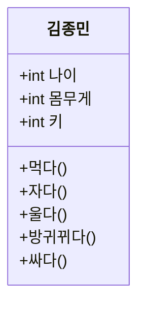
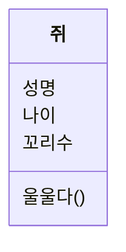
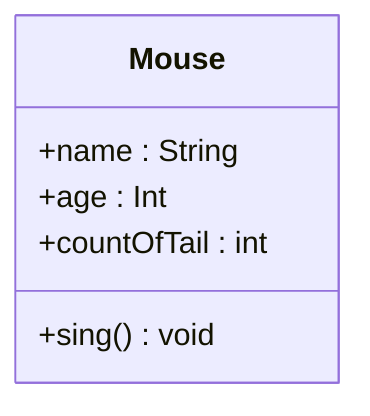

# 03. 자바와 객체 지향

## 객체지향은 인간지향이다

- 기존의 구조적 프로그래밍에서 함수 : Divide and Conquer (D&C)
- 객체지향 : 모든것은 사물이다 = 객체, object
  > 세상에 존재하는 모든것은 사물, 즉 객체이다(object)  
  > 각각의 사물은 고유하다  
  > 사물은 속성을 갖는다  
  > 사물은 행위를 한다.
- 사물을 **분류** (class)

  > 직립 보행을 하며 말을 하는 존재를 사람이라고 분류한다  
  > 연미복, 짧은다리, 날지 못하는 새를 펭귄이라고 분류한다  
  > 밤하늘에 반짝이는 사물들을 별이라고 분류한다

- 김종민(object), 한효주(object), 김연아(object) 라고 하는 존재는 사람이라는 분류에 속한다. 그리고 사람이라는 분류 안의 객체(object) 들은 나이, 몸무게, 키 등의 속성(property)과 먹다, 자다, 울다, 방귀뀌다, 싸다 등의 행위(method)를 가지고 있다.



## 객체지향의 4대 특성 - 캡상추다

| 객체지향의 4대 특성   |                              |
| --------------------- | ---------------------------- |
| 캡슐화(Encapsulation) | 정보은닉(information hiding) |
| 상속(inheritance)     | 재사용                       |
| 추상화(Abstraction)   | 모델링                       |
| 다형성(Polimorphism)  | 사용편의                     |

## 클래스 vs 객체 = 붕어빵틀 vs. 붕어빵??

        붕어빵틀 붕어빵 = new 붕어빵틀(); // ??

- 클래스와 객체를 구분하는 가장 간단한 방법은 나이를 물어 보는 것이다.  
  (ex. 사람의 나이는 몇살인가?)
- 클래스는 분류에 대한 개념이지 실체가 아니다.

        클래스 : 객체 = 펭귄 : 뽀로로 = 사람 : 김연아

## 추상화: 모델링

- 추상의 사전적 의미 : 여러가지 사물이나 개념에서 공통되는 특성이나 속성 따위를 추출하여 파악하는 작용
- 전산분야에서 추상화 : abstraction
- 입체파 화가 피카소의 추상화 : abstraction painting
- 추상화는 사실적인 모습이 아니라 각 부분의 특징을 가장 잘 표현할 수 있도록 그림을 그림.

### 객체지향의 추상화는 곧 모델링이다

- 객체, object: 세상에 존재하는 유일무이한 사물
- 클래스, class : 분류, 집합, 같은 속성과 기능을 가진 객체를 총칭하는 (집합의)개념
- 클래스를 이용해 object를 만들었다는 것을 강조할때 인스턴스라는 표현 사용

        객체, object = 클래스의 인스턴스

- 애플리케이션 경계 (context) : 내가 창조하려는 세상은 어떤 세상인가?, 내가 만들고자 하는 애플리케이션은 어디에서 사용될 것인가? (병원에서의 사람, 은행에서의 사람)

        추상화 : 구체적인 것을 분해해서 관심 영역(애플리케이션 경계,Application Boundary)
        에 대한 특성만을 가지고 재조합하는것 = 모델링


- 자바에서 객체 지향의 추상화 = 모델링 = 자바의 class 키워드
- 클래스와 객체 관계 표현 : 클래스 객체*참조*변수 = new 클래스();  
   = 새로운 객체를 하나 생성해 그 객체의 주소값(포인터)을 객체 참조 변수에 할당

## 추상화와 T메모리

- 쥐 객체의 특성

| 객체명 | 미키마우스                         | 제리                                 |
| ------ | ---------------------------------- | ------------------------------------ |
| 속성들 | 성명<br>국적<br>나이..등등         | 성명<br>국적<br>나이..등등           |
| 행위들 | 달리다()<br>먹다()<br>휘파람불다() | 달리다()<br>먹다()<br>장난치다()<br> |

- 클래스 설계 : 쥐 객체들을 관찰해 쥐 클래스 설계. 모델링에서 제일 중요한 것은 추상화다. 추상화를 통해 어플리케이션에서 관심있는 특성들만 뽑아옴(추상화의 결과는 설계자마다 다름. 주관적)
- 모델 : 추상화의 결과물. 자바 언어에서 클래스로 표현됨. (국제 표준 표기법 UML 다이어그램)
- 쥐 클래스의 논리적/ 물리적 설계





- T메모리 그리기

```java
package abstraction01;

public class MouseDriver {
	public static void main(String[] args) {
		Mouse mickey = new Mouse();

		mickey.name = "미키";
		mickey.age = 85;
		mickey.countOfTail = 1;

		mickey.sing();

		mickey = null;

		Mouse jerry = new Mouse();

		jerry.name = "제리";
		jerry.age = 73;
		jerry.countOfTail = 1;

		jerry.sing();
	}
}
```

- main()메서드를 실행하기 직전(4번째줄 직전)의 T메모리  
  
  - Mouse에서 name, age, countOfTail 에는 변수저장공간이 안보인다. 이 세개의 속성은 Mouse 클래스에 속한 속성이 아닌 Mouse 객체에 속한 속성이기 때문에 객체가 생성되어야만 속성의 값을 저장하기 위한 메모리 공간이 스태틱 영역이 아닌 힙 영역에 할당된다.
  - 클래스 멤버 메서드 MouseDriver의 static main() : 밑줄
  - 객체의 멤버 메서드 Mouse 클래스의 sing() : 밑줄 없이 UML 표기법에서 표현하기로 약속
- 5번째 줄의 Mouse mickey 실행한 후 T메모리  
  
- 5번째 줄의 new Mouse를 실행한 후 T메모리  
  
- 5번째 줄을 실행한 후 T메모리(주소값으로 표현)  
  
- 5번째 줄을 실행한 후 T메모리(화살표로 표현)  
  
- 9번째 줄을 실행한 후 T메모리  
  
- 13번째 줄 실행 및 가비지 컬렉션 이후 T메모리  
  

## 클래스 멤버 vs 객체 멤버 = static 멤버 vs 인스턴스 멤버

- 모든 객체들이 공통된 값을 갖는 속성을 클래스 레벨로 옮김.

```java
public static int countOfTail = 1;
```

- 객체\_참조\_변수.countOfTail : micket.countOfTail
- 클래스명.countOfTail 로 접근 가능 : Mouse.countOfTail
- static 키워드가 붙은 속성 : 클래스 멤버 속성
- static 이 안붙은 멤버 속성 : 객체 멤버 속성
- 클래스 설계 : 추상화를 통한 모델링으로 다음 4가지 요소 설계

| 멤버       | 키워드 | 설계                                     |
| ---------- | ------ | ---------------------------------------- |
| 클래스멤버 | static | 클래스 멤버 속성 <br> 클래스 멤버 메서드 |
| 객체멤버   |        | 객체 멤버 속성 <br> 객체 멤버 메서드     |

- 클래스 멤버 = static 멤버 = 정적 멤버
  객체 멤버 = 인스턴스 멤버 = 오브젝트 멤버
  필드 = 속성 = 프로퍼티(property)
- 정적 속성인 경우(static) T메모리의 스태틱 영역에 클래스가 배치될때 클래스 내부에 메모리 공간이 확보됨.
- 객체 속성은 속성명만 있지 실제 메모리 공간은 확보되지 않음. 객체 속성은 힙 영역에 객체가 생성되면 그때 각 객체 멤버 속성을 위한 메모리 공간이 할당된다.
- 정적 메서드는 언제 사용하는 것이 좋은가? : 클래스의 인스턴스를 만들지 않고 사용하게 되는 유틸리티성 메서드를 주로 정적 메서드로 구성. (Ex. Math 클래스)
- 지역변수 : 스택영역에 생기는 변수(함수,메서드)
  - 개발자가 별도로 초기화 하지 않으면 쓰레기값을 가짐.
  - 지역변수는 한 지역에서만 쓰는 변수라서 그 지역에서 초기화하는것이 논리적으로 맞다
- 클래스 속성과 객체 속성
  - 별도 초기화 하지 않아도 정수형은 0, 부동소수형은 0.0, 논리형은 false, 객체는 null 초기화
  - 멤버 변수는 공유 변수의 성격을 가지고 있음. 누가 초기화 해야 한다고 규정하기 어렵다.
- 세가지 변수 유형

| 이름          | 다른이름                                  | 사는곳(T메모리)             |
| ------------- | ----------------------------------------- | --------------------------- |
| static 변수   | 클래스[멤버]속성, 정적 변수, 정적 속성... | 스태틱 영역                 |
| 인스턴스 변수 | 객체[멤버]속성, 객체 변수...              | 힙영역                      |
| local변수     | 지역 변수                                 | 스택 영역(스택 프레임 내부) |

## 상속: 재사용 + 확장

- 객체지향에서의 상속 : 상위 클래스 특성을 하위 클래스에서 상속(특성 상속)하고 거기에 더해 필요한 특성을 추가, 즉 확장해서 사용. 확장, 세분화, 슈퍼클래스-서브클래스(상위클래스-하위클래스)
- 상위 클래스 쪽으로 갈수록 추상화, 일반화 됐다고 말하며, 하위 클래스 쪽으로 갈수록 구체화, 특수화 됐다고 말한다.
  
- 자바에서 inheritance(상속)이라는 키워드는 존재하지 않는다. extends(확장) 이라는 키워드 존재.

## 상속의 강력함

- 하위 클래스는 상위클래스다
- 하위 분류는 상위분류다

```java
package inheritance01;

public class Driver02 {
	public static void main(String[] args) {
		동물 animal = new 동물();
		동물 mammalia = new 포유류();
		동물 bird = new 조류();
		동물 whale = new 고래();
		동물 bat = new 박쥐();
		동물 sparrow = new 참새();
		동물 penguin = new 펭귄();

		animal.showMe();
		mammalia.showMe();
		bird.showMe();
		whale.showMe();
		bat.showMe();
		sparrow.showMe();
		penguin.showMe();
	}
}
```

```java
package inheritance01;

public class Driver03 {
	public static void main(String[] args) {
		동물[] animals = new 동물[7];

		animals[0] = new 동물();
		animals[1] = new 포유류();
		animals[2] = new 조류();
		animals[3] = new 고래();
		animals[4] = new 박쥐();
		animals[5] = new 참새();
		animals[6] = new 펭귄();

		for (int index = 0; index < animals.length; index++) {
			animals[index].showMe();
		}
	}
}
```

## 상속은 is a 관계를 만족해야 한다?

- 상속은 is a 보다 a kind of 라고 표현하는것이 더 명확
- 객체지향의 상속은 상위클래스의 특성을 재사용하는 것이다.
- 객체지향의 상속은 상위클래스의 특성을 확장하는 것이다.
- 객제지향의 상속은 is a kind of 관계를 만족해야 한다.

## 다중 상속과 자바

- 다중 상속의 다이아몬드 문제  
    
  사람과 물고기를 상속하는 인어에게 수영해! 라고 하면? 사람도 수영할 수 있고, 물고기도 수영할 수 있음.
- 따라서 자바는 다중상속을 포기하고 인터페이스 도입

## 상속과 인터페이스

- 상속관계 : 하위클래스 is a kind of 상위클래스
- 해석 : 하위클래스는 상위 클래스의 한 분류다
- 예제 : 고래는 동물의 한 분류다

- 인터페이스 : 구현클래스 is able to 인터페이스
- 해석 : 구현 클래스는 인터페이스 할 수 있다
- 예제 : 고래는 헤엄칠 수 있다

  - Serializable 인터페이스: 직렬화 할 수 있는
  - Cloneable 인터페이스: 복제할 수 있는
  - Comparable 인터페이스: 비교할 수 있는
  - Runnable 인터페이스: 실행할 수 있는

- 상위 클래스는 하위 클래스에게 특성(속성과 메서드)를 상속해주고, 인터페이스는 클래스가 '무엇을 할 수 있다'기능을 구현하도록 강제하게 된다.

- 상위클래스는 하위 클래스에게 물려줄 특성이 많을수록 좋을까? yes
  - LSP(리스코프 치환원칙)
- 인터페이스 구현을 강제할 메서드가 많을수록 좋을까? NO
  - ISP(인터페이스 분할 원칙)

## 상속과 UML 표기법


## 상속과 T메모리

```java
Penguin pororo = new Penguin();
```


```java
Animal pingu = new Penguin();
```


> **강제 타입 변환** (typecasting) 참고  
> Parent parent = new Child(); // 자동 타입 변환  
> Child child = (Child) parent; // 강제 타입 변환

## 다형성 : 사용편의성

- 오버라이딩 : 같은 메서드 이름, 같은 인자 목록으로 상위 클래스의 메서드를 재정의
- 오버로딩 : 같은 메서드 이름, 다른 인자목록으로 다수의 메서드를 중복정의

## 다형성과 T메모리

- 펭귄 클래스가 상위 클래스인 Animal 클래스의 showName() 메서드를 오버라이딩(재정의)했다는 것과 showName(yourName:String)메서드를 오버로딩(중복정의) 했다.

```java
Penguin pororo = new Penguin();
```


```java
Animal pingu = new Penguin();
```


- pingu 객체 참조 변수는 타입이 Animal
- 그림에서 보면 Animal 객체의 showName() 은 Penguin 객체의 showName()에 의해 가려져 있다.
- 따라서, pingu.showName() 메서드를 실행하면 Penguin 객체에 의해 재정의된 showName() 메서드가 실행된다.  
  => 상위클래스 타입의 객체 참조 변수를 사용하더라도 하위 클래스에서 오버라이딩(재정의)한 메서드가 호출된다.

## 다형성이 지원되지 않는 언어

- 다형성이 지원되지 않는다면?
  => 만약 두 정수를 더해서 반환해야 하는 함수 add(int, int) 가 있는데, int 와 float 을 더해서 반환해야 하는 함수가 필요해졌다면, add 함수명을 이미 사용했기 때문에 이름과 인자목록이 다른 함수를 만들어야 한다.

## 캡슐화 : 정보은닉

| UML표기법 | 접근제어자 |
| --------- | ---------- |
| -         | private    |
| ~         | default    |
| #         | protected  |
| +         | public     |

### 객체 멤버의 접근 제어자


| package | class   | method           | classA pri   | classA def   | classA pro   | classA pub   |
| ------- | ------- | ---------------- | ------------ | ------------ | ------------ | ------------ |
| One     | classA  | runSomething()   | o            | o            | o            | o            |
| ""      | ""      | runStaticThing() | o 객체생성후 | o 객체생성후 | o 객체생성후 | o 객체생성후 |
| ""      | classB  | runSomething()   | x            | o 객체생성후 | o 객체생성후 | o 객체생성후 |
| ""      | ""      | runStaticThing() | x            | o 객체생성후 | o 객체생성후 | o 객체생성후 |
| ""      | classAA | runSomething()   | x            | o            | o            | o            |
| ""      | ""      | runStaticThing() | x            | o 객체생성후 | o 객체생성후 | o 객체생성후 |
| Two     | classAB | runSomething()   | X            | X            | o            | o            |
| ""      | ""      | runStaticThing() | x            | x            | o 객체생성후 | o 객체생성후 |
| ""      | classC  | runSomething()   | x            | x            | x            | o 객체생성후 |
| ""      | ""      | runStaticThing() | x            | x            | o 객체생성후 | o 객체생성후 |


- 상속을 받지 않았다면 객체 멤버는 객체를 생성한 후 객체 참조 변수를 이용해 접근해야 한다.
- 정적 멤버는 클래스명.정적멤버 형식으로 접근하는것을 권장한다.

## 참조 변수의 복사

- 기본 자료형 변수는 저장하고 있는 값을 그 값 자체로 해석
- 객체 참조 변수는 저장하고 있는 값을 주소로 해석(포인터)
- 기본 자료형 변수를 복사할 때, 참조 자료형 변수를 복사할 때 일어나는 일은 같다. 즉, 가지고 있는 값을 그대로 복사해서 넘긴다.
