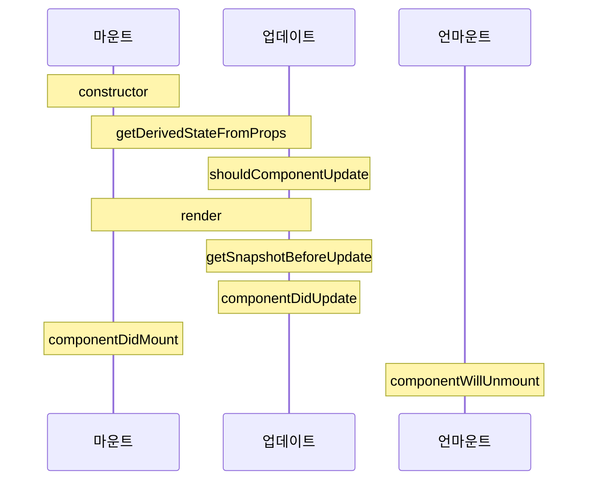

# {{ $frontmatter.title }}

## 컴포넌트 라이프사이클 메서드의 흐름



## 예제

```js
import React, { Component } from "react";

class LifeCycleSample extends Component {
  state = {
    number: 0,
    color: null,
  };

  myRef = null; // ref를 설정할 부분

  /**
   * 2.constructor : 컴포넌트를 만들때 처음으로 실행됨.
   * 메서드 안에서 초기 state 지정.
   */
  constructor(props) {
    super(props);
    console.log("constructor");
  }

  /**
   * 3. getDerivedStateFromProps : props로 받아온 값을 state에 동기화 시키는 용도.
   * 컴포넌트가 마운트 될 때와 업데이트 될 때 호출됨.
   */
  static getDerivedStateFromProps(nextProps, prevState) {
    console.log("getDerivedStateFromProps");
    if (nextProps.color !== prevState.color) {
      return { color: nextProps.color };
    }
    return null;
  }

  /**
   * 4.componentDidMount : 컴포넌트를 만들고 첫 렌더링을 다 마친 후 실행.
   * 이 안에서 자바스크립트 라이브러리 또는 프레임 워크의 함수를 호출하거나 이벤트 등록,
   * setTimeout, setInterval, 네트워크 요청 같은 비동기 작업을 처리한다.
   */
  componentDidMount() {
    console.log("componentDidMount");
  }

  /**
   * 5. shouldComponentUpdate : props 또는 state 를 변경했을때 리렌더링을 시작할지 여부를 지정하는 메서드
   * 반드시 true 또는 false를 반환해야 함. 기본은 true 반환
   * 메서드가 false 값을 반환한다면 업데이트 과정은 여기서 중지됨.
   * 현재 props와 state 는 this.props 와 this.state 로 접근 가능.
   * 새로 생성될 props와 state는 nextProps와 nextState로 접근 할 수 있다.
   */
  shouldComponentUpdate(nextProps, nextState) {
    console.log("shouldComponentUpdate", nextProps, nextState);
    // 숫자의 마지막 자리가 4면 리렌더링하지 않습니다.
    return nextState.number % 10 !== 4;
  }

  /**
   * 6. getSnapshotBeforeUpdate : render에서 만들어진 결과물이 브라우저에 실제로 반영되기 직전에 호출.
   * 이 메서드에서 반환하는 값은 componentDidUpdate에서 세번째 파라미터 snapshot 값으로 전달 받을 수 있다.
   */
  getSnapshotBeforeUpdate(prevProps, prevState) {
    console.log("getSnapshotBeforeUpdate");
    if (prevProps.color !== this.props.color) {
      return this.myRef.style.color;
    }
    return null;
  }

  /**
   * 7. componentDidUpdate : 리렌더링 완료 후 실행. 업데이트가 끝난 직후 이므로 DOM 관련 처리를 해도 무방.
   * prevProps, prevState를 사용하여 컴포넌트가 이전에 가졌던 데이터에 접근 가능.
   */
  componentDidUpdate(prevProps, prevState, snapshot) {
    console.log("componentDidUpdate", prevProps, prevState);
    if (snapshot) {
      console.log("업데이트되기 직전 색상: ", snapshot);
    }
  }

  /**
   * 8.componentWillUnmount : 컴포넌트를 DOM에서 제거할 때 실행.
   * componentDidMount 에서 등록한 이벤트, 타이머, 직접생성한 DOM 여기서 제거 작업.
   */
  componentWillUnmount() {
    console.log("componentWillUnmount");
  }

  /**
   * 9.componentDidCatch : 컴포넌트 렌더링 도중에 에러가 발생했을때 오류 UI를 보여줌.
   */
  componentDidCatch(error, info) {
    this.setState({
      error: true,
    });
    console.log({ error, info });
  }

  handleClick = () => {
    this.setState({
      number: this.state.number + 1,
    });
  };

  /**
   * 1. render : 컴포넌트 모양새 정의.
   * 메서드 안에서 this.props와 this.state에 접근. 리액트 요소 반환(div)
   */
  render() {
    console.log("render");

    const style = {
      color: this.props.color,
    };

    return (
      <div>
        <h1 style={style} ref={(ref) => (this.myRef = ref)}>
          {this.state.number}
        </h1>
        <p>color: {this.state.color}</p>
        <button onClick={this.handleClick}>더하기</button>
      </div>
    );
  }
}
export default LifeCycleSample;
```

## strict 모드 끄기

디버그 돌려보면 대충 어느 순서로 가는지 감이 오는데  
두번씩 실행되서 헷갈린다.  
이럴때 strict 모드를 끄면 된다.  
성능 향상 이나 Rendering 최적화를 할때는 끄고 평소에는 키고 하는것이 좋다.

`index.js`

```js
const root = ReactDOM.createRoot(document.getElementById("root"));
root.render(
  // <React.StrictMode>
  <App />
  // </React.StrictMode>
);
```

[참고블로그](https://innovatorwhy.tistory.com/6)
