# {{ $frontmatter.title }}

## 동기적(synchronous) vs 비동기적(asynchronous)

```mermaid
gantt
    title 동기적(synchronous) vs 비동기적(asynchronous)
    dateFormat X
    axisFormat %s
    section 동기적
    1   : 0, 3
    2   : 3, 4
    3   : 4, 6
    4   : 6, 7
    section 비동기적
    1   : 0, 3
    2   : 0, 1
    3   : 0, 2
    4   : 0, 1
```

## async/await

- [https://triplexblog.kr/170](https://triplexblog.kr/170)
- async/await : Promise를 더욱 쉽게 사용할 수 있도록 해 주는 ES2017(ES8) 문법. Promise가 끝날 때까지 기다리고, 결과 값을 특정 변수에 담을 수 있다.
- 함수의 앞부분에 async 키워드를 추가하고, 해당 함수 내부에서 Promise의 앞부분에 await 키워드를 사용
- axios : HTTP 요청을 Promise 기반으로 처리하는 자바스크립트 HTTP 클라이언트 라이브러리
