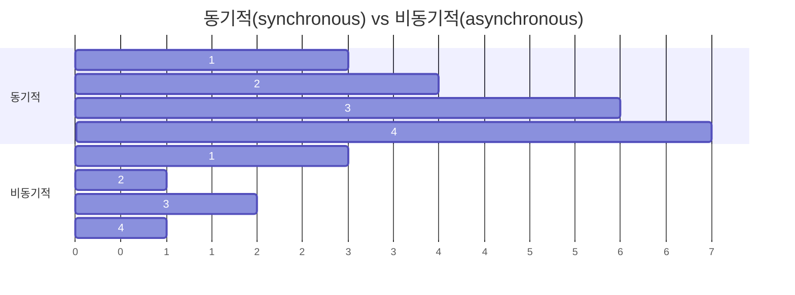

# {{ $frontmatter.title }}

## 동기적(synchronous) vs 비동기적(asynchronous)

```mermaid
gantt
    title 동기적(synchronous) vs 비동기적(asynchronous)
    dateFormat X
    axisFormat %s
    section 동기적
    1   : 0, 3
    2   : 3, 4
    3   : 4, 6
    4   : 6, 7
    section 비동기적
    1   : 0, 3
    2   : 0, 1
    3   : 0, 2
    4   : 0, 1
```

## async/await

함수의 앞부분에 async 키워드를 추가하고, 해당 함수 내부에서 Promise의 앞부분에 await 키워드를 사용.
