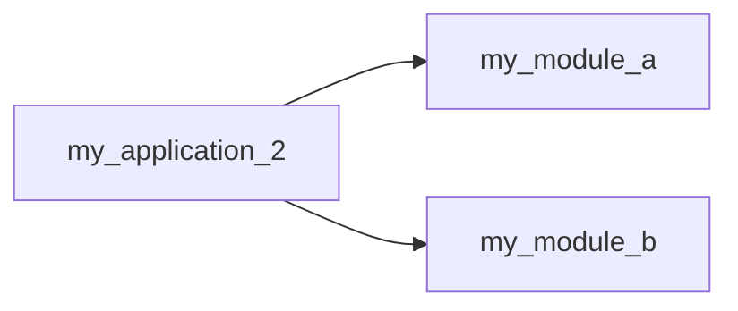
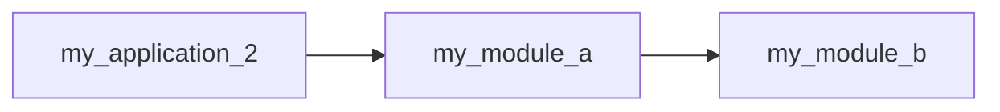
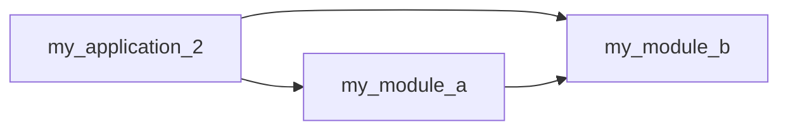

# 10. 라이브러리와 모듈

## 10.1 라이브러리

- 라이브러리(library) : 프로그램 개발 시 활용할 수 있는 클래스와 인터페이스들을 모아놓은 것.
- 일반적으로 JAR(java archive) 압축파일(~.jar) 형태로 존재
- JAR 파일에는 클래스와 인터페이스의 바이트코드파일(~.class) 들이 압축되어 있다.
- 특정 클래스와 인터페이스가 여러 응용프로그램을 개발할때 공통으로 자주 사용된다면 JAR 파일로 압축해서 라이브러리로 관리하는것이 좋다.
- 프로그램 개발시 라이브러리를 이용하려면 라이브러리 JAR파일을 ClassPath에 추가해야 한다. ClassPath란 클래스를 찾기 위한 경로이다
- ClassPath에 라이브러리 추가하는 방법
  - 콘솔(명령 프롬프트 또는 터미널) 에서 프로그램을 실행할 경우
    - java 명령어를 실행할때 -classpath로 제공
    - CLASSPATH 환경 변수에 경로를 추가
  - 이클립스 프로젝트에서 실행할 경우
    - 프로젝트의 Build Path에 추가

### my_lib 라이브러리 프로젝트 생성

1. 프로젝트 생성
2. 패키지 생성, 클래스 생성
3. 프로젝트에서 dist 폴더 생성
4. 프로젝트 선택 후 마우스 오른쪽 버튼 클릭 export 선택, JAR file 선택
5. my_lib 의 src 체크
6. select the export destination 에 원하는 경로, 파일이름 입력
7. finish/ refresh project

## 10.2 모듈

- 모듈(module) : java 9 부터 지원. 패키지 관리 기능까지 포함된 라이브러리. 일반 라이브러리는 내부에 포함된 모든 패키지에 외부 프로그램에서의 접근이 가능하지만, 모듈은 일부 패키지를 은닉하여 접근할 수 없게끔 할 수 있다.
- 모듈은 자신이 실행할때 필요로 하는 의존 모듈을 모듈 기술자(module-info.java)에 기술할 수 있기 때문에 모듈 간의 의존 관계를 쉽게 파악할 수 있다.
- 모듈도 라이브러리이므로 JAR 파일 형태로 배포할 수 있다. 응용프로그램을 개발할때 원하는 기능의 모듈 (JAR) 파일을 다운로드해서 이용하면 된다.
- 대규모 응용프로그램은 기능별로 모듈화(modulization) 해서 개발할 수도 있다. 모듈별로 개발하고 조립하는 방식을 사용하면 재사용성 및 유지보수에 유리.

## 10.3 응용프로그램 모듈화

- 응용프로그램은 하나의 프로젝트로도 개발이 가능하지만, 이것을 기능별로 서브 프로젝트(모듈)로 쪼갠 다음 조합해서 개발할 수도 있다.
- 응용프로그램의 규모가 커질수록 협업과 유지보수 측면에서 서브 모듈로 쪼개서 개발하는 것이 유리
- 이렇게 개발된 모듈들은 다른 응용프로그램에서도 재사용이 가능.

### my_module_a 모듈 생성

1. create project, create module-info.java 체크
2. 모듈 name 입력
3. 패키지, 클래스 생성
4.

### my_module_b 모듈 생성

1. a 와 동일

`module-info.java`

    module my_module_a {
        exports pack1;
        exports pack2;
    }

### my_application_2 프로젝트 생성

> #### 응용프로그램도 하나의 모듈
>
> my_application_2는 모듈로 개발하는것이 아니라 다른 모듈을 조합하는 응용 프로그램을 위한 프로젝트이다.
> 그럼에도 불구하고 모듈 기술자(module-info.java)가 필요하다.
> 어떤 모듈을 가져와 사용할 것 인지를 기술해야 하기 때문
> 일반적으로 모듈 기술자가 포함된 프로젝트를 모듈이라고 한다.

1. 프로젝트 생성
2. 모듈 info 생성
3. `module-info.java` 작성

<br>

    module my_application_2 {
        requires my_module_a;
        requires my_module_b;
    }

4. build path -> module path tjfwjd
5. 모듈 a,b 선택

## 10.4 모듈 배포용 JAR 파일

- 모듈 개발을 완료했다면 다른 모듈에서 쉽게 사용할 수 있도록 바이트코드 파일(.class)로 구성된 배포용 JAR 파일을 생성

### 모듈 배포용 JAR 파일 생성

0. dist 폴더 생성
1. 모듈 선택하고 export
2. jar 파일 선택
3. src 체크
4. destination은 dist 폴더, 파일 이름 임력
5. dist 폴더에 jar 파일 생성 확인 (refresh)
6. my_module_b 도 동일

### my_application_3 생성

1. new project 생성
2. create module-info.java
3. build path > library > modulepaht 선택 > add external jars
4. my_module_a.jar, my_module_b.jar 추가
5. `module-info.java`

<br>

    module my_application_3 {
        requires my_module_a;
        requires my_module_b;
    }

## 10.5 패키지 은닉

- 모듈은 모듈 기술자(module-info.java)에서 exports 키워드를 사용해 내부 패키지 중 외부에서 사용할 패키지를 지정한다.
- exports 되지 않은 패키지는 자동적으로 은닉된다.
- 모듈이 일부 패키지를 은닉하는 이유
  - 모듈 사용 방법 통일 : 모듈 외부에서 패키지 2와 3을 사용하지 못하도록 막고, 패키지 1 로 사용 방법을 통일한다
  - 쉬운 수정 : 모듈 성능 향상을 위해 패키지 2와 3을 수정하더라도 모듈 사용 방법(패키지 1)이 달라지지 않기 때문에 외부에 영향을 주지 않는다.

## 10.6 전이 의존



- 다음과 같이 의존관계를 변경





### my_module_a 모듈 수정

1. my_module_a 의 configure build path > project 탭 > modulepath 항목 > add > my_module_b 체크
2. apply and close
3.

```java
module my_module_a {
    exports pack1;
    // exports pack2;
    requires transitive my_module_b;// my_module_b 모듈 의존 설정
}
```

## 10.7 집합 모듈

- 집합 모듈 : 여러 모듈을 모아놓은 모듈. 자주 사용하는 모듈을 일일이 requires 하는 번거로움을 피하고 싶을때 집합 모듈을 생성하면 편리하다. 집합 모듈은 자체적인 패키지를 가지지 않고 모듈 기술자에 전이 의존 설정만 한다.

```java
module my_module {
	requires transitive my_module_a;
	requires transitive my_module_b;
}

module my_application_2 {
//	requires my_module_a;
//	requires my_module_b;
	requires my_module; // my_module 모듈에만 의존
}
```

## 10.8 리플렉션 허용

- 은닉된 패키지는 기본적으로 다른 모듈에 의해 리플렉션을 허용하지 않는다.
- 리플렉션 (reflection) : 실행 도중에 타입(클래스, 인터페이스 등)을 검사하고 구성 멤버를 조사하는것.
- 경우에 따라서 은닉된 패키지도 리플렉션을 허용해야 할 때가 있다. 모듈은 모듈 기술자를 통해 모듈 전체 또는 지정된 패키지에 대해 리플렉션을 허용할 수 있고, 특정 외부 모듈에만 리플렉션을 허용할 수도 있다.
- 모듈 전체를 리플렉션 허용 : open module 모듈명 {...}
- 지정된 패키지에 대해 리플렉션 허용 : module 모듈명 { opens 패키지1; opens 패키지2;}
- 지정된 패키지에 대해 특정 외부 모듈에서만 리플렉션 허용 : module 모듈명 { opens 패키지1 to 외부모듈명,..;}
- export 된 패키지는 언제든지 리플렉션이 가능하므로 opens 로 지정할 필요가 없다.
- opens는 은닉된 패키지 중에서 특정 패키지에 대한 리플렉션을 허용한다.

## 10.9 자바 표준 모듈

- 자바 프로그램이라면 반드시 활용해야 하는 라이브러리가 있다. 바로 JDK가 제공하는 표준 라이브러리.
- 표준 라이브러리는 java 9부터 모듈화가 되어 java17 표준 모듈이 완성되었다.
- [java17의 전체 모듈 그래프](https://docs.oracle.com/en/java/javase/17/docs/api/java.se/module-summary.html)
- java.base는 모든 모듈이 의존하는 기본 모듈이다. java.base 모듈은 requires 하지 않아도 사용할 수 있지만 다른 모듈들은 모듈 기술자에 requires를 명시하고 사용해야 한다.
- java.se 는 JDK 가 제공하는 모든 모듈을 제공하는 집합 모듈이다. Java8 이전 버전과 같이 자바 표준 라이브러리를 제한 없이 사용하고 싶을 경우에는 이 java.se 를 requires 하면 된다.

        module my_application {
            requires java.se;
        }

- 모듈 기술자가 없으면 모듈로 인식되지 않기 때문에 자바 표준 라이브러리를 제한없이 사용할 수 있다.
- java8 이전 버전까지는 응용프로그램이 표준 라이브러리의 5%만 사용하는데도 불구하고 응용프로그램을 실행하려면 전체 표준 라이브러리가 갖추어진 자바 실행환경 (JRE)가 필요했었다.
- 표준 라이브러리를 모듈화한 이유는 응용프로그램을 실행하는데 필요한 모듈만으로 구성된 작은 사이즈의 자바 실행환경(JRE)를 만들기 위해서이다.
- 작은 사이즈의 자바 환경이 필요한 경우
  - 독립 실행형(응용프로그램 + 표준 라이브러리) 으로 배포할 경우 표준 라이브러리의 크기가 작을수록 배포 사이즈가 줄어든다.
  - 제한된 자원만 가지고 있는 소형(임베디드) 기기에는 사이즈가 작은 자바 실행환경이 필요하다
- 작은 실행 환경을 jlink 명령어로 생성할 수 있다.
