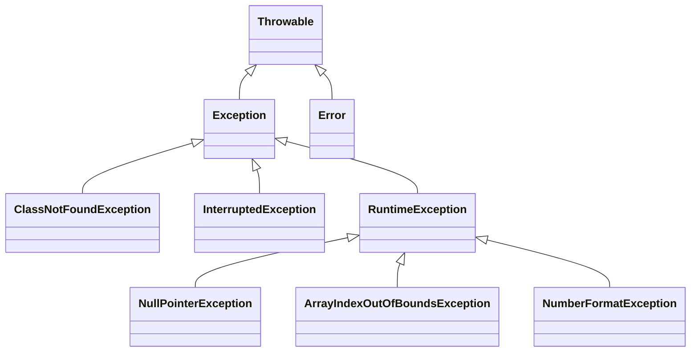

# 11. 예외처리

## 11.1 예외와 예외 클래스

- 예외(exception) : 예외란 잘못된 사용 또는 코딩으로 인한 오류. 예외가 발생되면 프로그램은 곧바로 종료된다는 점에서 에러와 동일하지만, 예외 처리를 통해 계속 실행상태를 유지할 수 있다.
  - 일반 예외(Exception) : 컴파일러가 예외 처리 코드 여부를 검사하는 예외
  - 실행 예외(Runtime Exception) : 컴파일러가 예외 처리 코드 여부를 검사하지 않는 예외를 말한다.
- 자바는 예외가 발생하면 예외 클래스로부터 객체를 생성. 이 객체는 예외 처리 시 사용된다.
- 자바의 모든 에러와 예외 클래스는 Throwable을 상속받아 만들어지고, 추가적으로 예외 클래스는 java.lang.Exception 클래스를 상속받는다.



- 실행 예외는 RuntimeException과 그 자식 클래스에 해당한다.
- 그 밖의 예외 클래스는 모두 일반 예외이다.

## 11.2 예외 처리 코드

- 예외 처리 코드는 try-catch-finally 블록으로 구성된다.
- finally 생략 가능

```java
try {
    int result = data.length();
    System.out.println("문자수 : " + result);
} catch(NullPointerException e) {
    System.out.println(e.getMessage()); // 예외 정보를 얻는 3가지 방법
    System.out.println(e.toString());
    e.printStackTrace();
} finally {
    System.out.println("마무리실행");
}
```

## 11.3 예외 종류에 따른 처리

    try {
        ArrayIndexOutOfBoundsException 발생
        NumberFormatException 발생
    } catch(ArrayIndexOutOfBoundsException e) {
        예외처리 1
    } catch(NumberFormatException e) {
        예외처리2
    }

- catch 블록이 여러개라 할지라도 catch 블록은 단 하나만 실행된다.
- 처리해야 할 예외 클래스들이 상속관계에 있을 때에는 하위 클래스 catch 블록을 먼저 작성하고 상위 클래스 catch 블록을 나중에 작성해야 한다.
- 두개 이상의 예외를 하나의 catch 블록으로 동일하게 예외 처리하고 싶을때 catch 블록에 예외 클래스 기호 | 로 연결하면 된다.
- catch(ArrayIndexOutOfBoundsException | NumberFormatException e)

## 11.4 리소스 자동 닫기

- 리소스(resource) : 데이터를 제공하는 객체. 리소스는 사용하기 위해 열어야하며, 사용이 끝난 다음에는 닫아야 한다.
- FileInputStream 사용 : 예외 발생 여부와 상관없이 finally 블록에서 안전하게 close 한다
- try-with-resources : 예외 발생 여부와 상관없이 리소스를 자동으로 닫아 준다. try 괄호 안에 리소스를 여는 코드를 작성하면 try 블록이 정상적으로 실행을 완료했거나 도중에 예외가 발생하면 자동으로 리소스의 close() 메소드가 호출된다. 리소스는 java.lang.AutoCloseable 인터페이스를 구현해서 AutoCloseable 인터페이스의 close() 메소드를 재정의해야 한다.

```java
// FileInputStream 사용
FileInputStream fis = null;
try{
    fis = new FileInputStream("file.txt"); // 파일 열기
    ...
} catch(IOException e) {
    ...
} finally {
    fis.close(); // 파일 닫기
}

// try-with-resources 사용
try (FileInputStream fis = new FileInputStream("file.txt")){
    ...
} catch (IOException e) {
    ...
}

public class FileInputStream implements AutoCloseable {
    ...
    @Override
    public void close() throws Exception {...}
}
```

## 11.5 예외 떠넘기기

- 메소드 내부에서 예외가 발생할때 try-catch 블록으로 예외를 처리하는것이 기본이지만, 메소드를 호출한 곳으로 예외를 떠넘길 수도 있다. 이때 사용하는 키워드가 throws 이다.

        리턴타입 메소드명(매개변수, ...) throws 예외클래스1, 예외클래스2, ... {

        }

```java
public class ThrowsExample1{
    public static void main(String[] args){
        try{
            findClass();
        } catch (ClassNotFoundException e) { // 호출한 곳에서 예외처리
            System.out.println("예외처리"+e.toString());
        }
    }

    public static void findClass() throws ClassNotFoundException {
        Class.forName("java.lang.String2");
    }
}
```

- 나열해야 할 예외클래스가 많을 경우에는 throws Exception 또는 throws Throwable 만으로 모든 예외를 간단히 떠넘길 수도 있다

        리턴타임 메소드명(매개변수,...) throws Exception {}

- main() 메소드에서도 throws 키워드를 사용해서 예외를 떠넘길 수 있는데, 결국 JVM이 최종적으로 예외 처리를 하게 된다. JVM은 예외의 내용을 콘솔에 출력하는 것으로 예외 처리를 한다.

        public static void main(String[] args) throws Exception {...}

## 11.6 사용자 정의 예외

- 사용자 정의 예외 : 표준 라이브러리에 존재하지 않는 예외 직접 예외 클래스를 정의해서 사용.

## 사용자 정의 예외

- 일반 예외(컴파일러가 체크) : Exception 의 자식 클래스로 선언
- 실행 예외(컴파일러가 체크 하지 않음) : RuntimeException 의 자식클래스로 선언

        public class XXXException extends [Exception | RuntimeException] {
            public XXXException() {} // 기본생성자
            public XXXException(String message){ // 예외 메시지를 입력받는 생성자
                super(message);
            }
        }

### 예외 발생 시키기

- 표준 예외 뿐만 아니라 사용자 정의 예외를 직접 코드에서 발생시키려면 throw 키워드와 함께 예외 객체를 제공하면 된다.
- 예외의 원인에 해당하는 메시지를 제공하고 싶다면 생성자 매개값으로 전달한다.
- throw 된 예외는 직접 try-catch 블록으로 예외를 처리할 수도 있지만, 대부분 메소드를 호출한 곳에서 예외를 처리하도록 throws 키워드로 예외를 떠넘긴다.

        Class exceptionexample {
            void method() throws Exception {  // 호출한 곳으로 예외 떠넘김
                throw new Exception("예외메시지"); // 예외 발생
            }
        }

        public static void main(String[] args) {
            try {
                method();
            } catch (Exception e) {
                System.out.println(e.message); // 예외 처리
            }
        }
